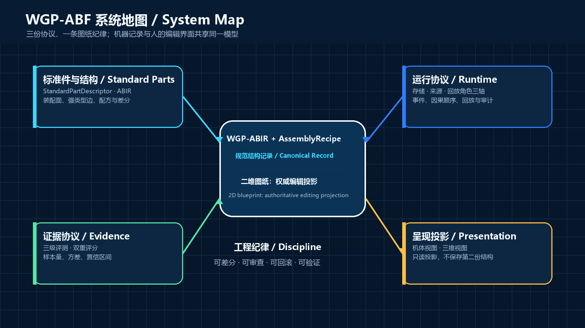
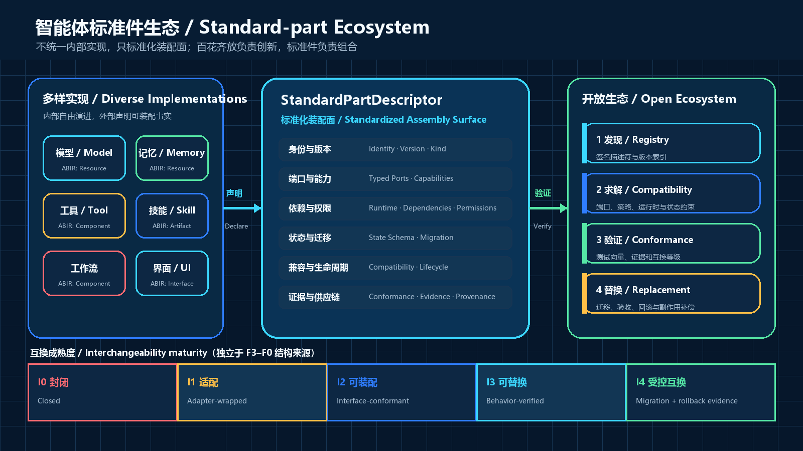

<!-- SPDX-License-Identifier: CC-BY-4.0 -->

# WGP-ABF English guide

[Bilingual home](README.md) · [Read the full English whitepaper](whitepaper/WGP-ABF_Whitepaper_v0.5.en.md) · [Download PDF](output/pdf/WGP-ABF-Whitepaper-v0.5.0-en.pdf)

WGP-ABF is an agent-configuration engineering method originated by Wang Guangping. It is not another node orchestrator and does not standardize internal implementations. It standardizes the assembly surfaces of models, memory, tools, skills, workflows, and interfaces so they can be honestly extracted, freely assembled, visually edited, semantically diffed, natively compiled, evidenced at runtime, and validated under control.

## The system in one diagram

`WGP-ABIR + AssemblyRecipe` form the canonical structural record. The two-dimensional engineering blueprint is the authoritative human editing projection. Body and 3D experiences are optional, read-only explanation projections. Every view shares the same engineering identities and no view stores a second business model.

Diversity drives innovation; standard parts enable composition. `StandardPartDescriptor` standardizes identity, object kind, ports, capabilities, dependencies, permissions, state migration, and evidence entry points. I0-I4 is a directed, environment- and time-bounded interchangeability result derived by machine from cumulative evidence; it does not replace a declaration of concrete capabilities such as hot reload. An external append-only `EvidenceStatusRecord` withdraws an immutable report without rewriting it.

## What ordinary users should gain

1. See how models, tools, memory, permissions, sandboxes, and subagents connect.
2. Complete goals such as replacing a model, adding memory, or tightening network access through safe guided actions.
3. Review impact, risk, restart requirements, and recovery before a change is applied.
4. Revalidate under comparable tasks and environments instead of treating “it started” as success.
5. Receive explanations that resolve to components, edges, and primary evidence.

## Where implementers start

1. Read the whitepaper sections on version discipline, standard parts, the canonical record, source claims, diffs, and runtime events.
2. Inspect the JSON Schemas in [`spec/`](spec/).
3. Follow the recipe, ABIR, diff, events, and evaluation loop in [`examples/minimal-agent/`](examples/minimal-agent/).
4. Implement a version-pinned importer/compiler adapter for one target platform.
5. Deliver C1 read-only blueprints first, then progress to C2 operations and C3 evidence.

## Important limits

- F3–F0 describes information provenance; it does not grant editing or write-back.
- I0-I4 describes interchangeability maturity; provenance, marketing claims, or similar file formats cannot grant it automatically.
- A fixed model-response stream is a contract-regression tool, not causal proof.
- A configuration inverse cannot undo external side effects such as sent messages or deleted records.
- Security policy must be enforced outside the model; hidden structure is not a security boundary.
- A body or 3D view is never required for core conformance.

## Contributing

Small corrections may use a pull request. Proposals that change specification meaning should start as an RFC and update schemas, valid and invalid examples, migration notes, and both language editions together. Read [CONTRIBUTING.md](CONTRIBUTING.md) and [GOVERNANCE.md](GOVERNANCE.md).

The canonical repository is [pingta-guangpingwang/wgp-agent-bodification-flow](https://github.com/pingta-guangpingwang/wgp-agent-bodification-flow), with public [Issues](https://github.com/pingta-guangpingwang/wgp-agent-bodification-flow/issues) for defects and proposals. Whitepaper series `0.5`, machine release `0.5.0`, format family `/0.5`, and immutable tag `v0.5.0` have distinct roles explained in the version-discipline section.

## Licensing

The whitepaper and original diagrams use CC BY 4.0. Schemas, examples, and scripts use Apache-2.0. Open licensing does not transfer Wang Guangping's copyright in the original work. Project names, logos, and future certification marks are governed separately by [TRADEMARKS.md](TRADEMARKS.md).
