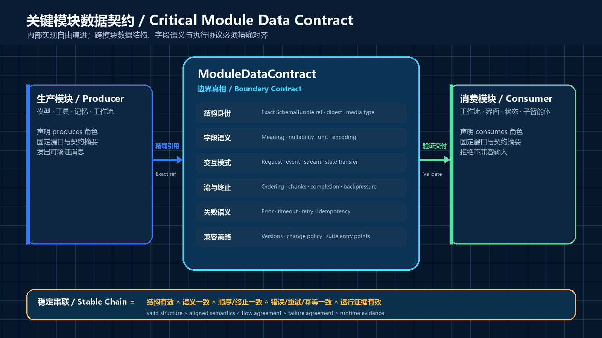

<!-- SPDX-License-Identifier: CC-BY-4.0 -->

# WGP Agent Bodification Flow（WGP-ABF）

> 模块数据契约、智能体工程图纸与证据化演进框架 
> An engineering framework for module data contracts, agent blueprints, and evidence-governed evolution

[简体中文](README.zh-CN.md) · [English](README.en.md) · [中文白皮书](whitepaper/WGP-ABF_Whitepaper_v0.6.zh-CN.md) · [English whitepaper](whitepaper/WGP-ABF_Whitepaper_v0.6.en.md) · [v0.5 → v0.6 migration / 迁移](MIGRATION-v0.5-to-v0.6.md)

**Public Draft 0.6 · 公开草案 0.6** 
**Originator and principal author / 概念提出者与主要作者：Wang Guangping / 王广平**

WGP-ABF aligns data structures and exchange semantics at critical module boundaries, then turns diverse implementations into verifiable Standard Parts and first-class engineering artifacts.

WGP-ABF 不统一智能体的内部实现。`SchemaBundle` 是独立、不可变的数据结构闭包；`ModuleDataContract` exact-reference 它，并唯一定义关键边界的字段语义、协议、流、顺序、错误、超时、重试、幂等和状态。标准件再实现并打包这些契约。数据结构对齐支撑自由装配，执行语义与生产者→消费者证据保障稳定串联。

The v0.6 trust chain runs from an immutable SchemaBundle and exact `ModuleDataContract` through resolved producer→consumer Bindings to executable evidence; Standard-Part discovery and replacement build on that chain. / v0.6 的可信链从不可变 SchemaBundle 与 exact `ModuleDataContract` 出发，经解析后的生产者→消费者 Binding 到达可执行证据；标准件发现与替换建立在该链之上。

## Read / 阅读

| Language | Markdown | PDF |
|---|---|---|
| 简体中文 | [v0.6 中文白皮书](whitepaper/WGP-ABF_Whitepaper_v0.6.zh-CN.md) | [下载中文 PDF](output/pdf/WGP-ABF-Whitepaper-v0.6.0-zh-CN.pdf) |
| English | [v0.6 English whitepaper](whitepaper/WGP-ABF_Whitepaper_v0.6.en.md) | [Download English PDF](output/pdf/WGP-ABF-Whitepaper-v0.6.0-en.pdf) |

Release assets / 发布文件：[中文 PDF](https://github.com/pingta-guangpingwang/wgp-agent-bodification-flow/releases/download/v0.6.0/WGP-ABF-Whitepaper-v0.6.0-zh-CN.pdf) · [English PDF](https://github.com/pingta-guangpingwang/wgp-agent-bodification-flow/releases/download/v0.6.0/WGP-ABF-Whitepaper-v0.6.0-en.pdf) · [Specification bundle / 规范包](https://github.com/pingta-guangpingwang/wgp-agent-bodification-flow/releases/download/v0.6.0/WGP-ABF-Spec-Bundle-v0.6.0.zip) · [SHA-256](https://github.com/pingta-guangpingwang/wgp-agent-bodification-flow/releases/download/v0.6.0/WGP-ABF-v0.6.0-SHA256SUMS.txt)

The original Chinese v0.3 draft is preserved in [`archive/v0.3`](archive/v0.3/). / 中文 v0.3 原稿完整保存在 [`archive/v0.3`](archive/v0.3/)。

## What is new in v0.6 / v0.6 的关键改进

- `ModuleDataContract` becomes the primary standardization object. It exact-references an independent immutable `SchemaBundle` and uniquely owns boundary field meaning, protocol, streaming, ordering, error, timeout, retry, idempotency, and state semantics.
- Publication dependencies are acyclic: immutable Bundle/Contract/Port/Descriptor/Profile/Suite facts precede directed contract-compatibility assessments; those assessments can be consumed by a resolved Recipe; Recipe-bound runtime events and reports then support later interchangeability and replacement conclusions. A compatibility assessment never pins a target Recipe, while a Report exact-references the Recipe it actually exercised. Descriptor implementation mapping and Recipe instance-port mapping remain separate facts.
- Format compatibility is explicitly separated from execution-semantic alignment, chain verification, behavioral equivalence, and task quality.
- `ConformanceReport` is producer→consumer chain evidence bound to an exact Contract, Binding, implementations, Profile, Suite, executor, and environment.
- I1–I3 are now **Contract-exposed**, **Data-aligned**, and **Chain-verified**; I0–I4 remains orthogonal to F3–F0, C0–C3, and operation capabilities.
- Standard-Part markets and replacement remain valuable applications above the contract layer, with v0.5 migration guidance in [`MIGRATION-v0.5-to-v0.6.md`](MIGRATION-v0.5-to-v0.6.md).

## Repository / 仓库内容

- `whitepaper/` — bilingual illustrated whitepaper / 双语图解白皮书
- `spec/` — JSON Schema 2020-12 specifications / 机器可验证规范
- `examples/minimal-agent/` — minimal end-to-end example / 最小闭环样例
- `assets/` — original cover, diagrams, and provenance / 原创封面、图解与来源记录
- `scripts/` — versioned diagram, PDF, validation, and release builders; see [`BUILDING.md`](BUILDING.md) / 带版本的图表、PDF、验证与发布构建源，详见 [`BUILDING.md`](BUILDING.md)
- `governance/` and root policy files — contribution and rights model / 贡献与权利治理

## Status / 状态

This repository is a public draft, not an industry standard, certification program, security guarantee, or legal advice. Conformance claims must name the WGP-ABF version, validator version, adapter version, exceptions, and evidence.

本仓库是公开草案，不是行业标准、认证计划、安全保证或法律意见。任何合规声明都必须注明 WGP-ABF、验证器与适配器版本、例外和证据。

The canonical repository is [pingta-guangpingwang/wgp-agent-bodification-flow](https://github.com/pingta-guangpingwang/wgp-agent-bodification-flow); use its [Issues](https://github.com/pingta-guangpingwang/wgp-agent-bodification-flow/issues) for specification defects, interoperability reports, translation drift, and change proposals.

规范主仓库是 [pingta-guangpingwang/wgp-agent-bodification-flow](https://github.com/pingta-guangpingwang/wgp-agent-bodification-flow)；规范缺陷、互操作报告、翻译差异和变更提案请提交到 [Issues](https://github.com/pingta-guangpingwang/wgp-agent-bodification-flow/issues)。

Version labels serve different purposes: **0.6** is the reader-facing whitepaper series, **0.6.0** is the SemVer package/specification release, `/0.6` names the compatible document-format family, and immutable tag **`v0.6.0`** fixes this release's schemas and artifacts.

版本标识分工不同：**0.6** 是面向读者的白皮书系列，**0.6.0** 是 SemVer 包/机器规范版本，`/0.6` 是文档格式兼容族，不可变标签 **`v0.6.0`** 固定本次发布的 Schema 与产物。

## License and authorship / 许可与作者权

- Whitepaper, original diagrams, README, and governance prose: [CC BY 4.0](LICENSES/CC-BY-4.0.txt).
- Schemas, examples, scripts, and reference code: [Apache License 2.0](LICENSES/Apache-2.0.txt).
- WGP-ABF names, logos, and conformance/certification marks are governed separately by [TRADEMARKS.md](TRADEMARKS.md).

Open licensing does not transfer copyright. For CC BY 4.0 material, preserve attribution to **Wang Guangping / 王广平**, link the license, and identify modifications. For Apache-2.0 material, preserve the license and required notices. See [NOTICE](NOTICE), [AUTHORS.md](AUTHORS.md), and [CITATION.cff](CITATION.cff).
