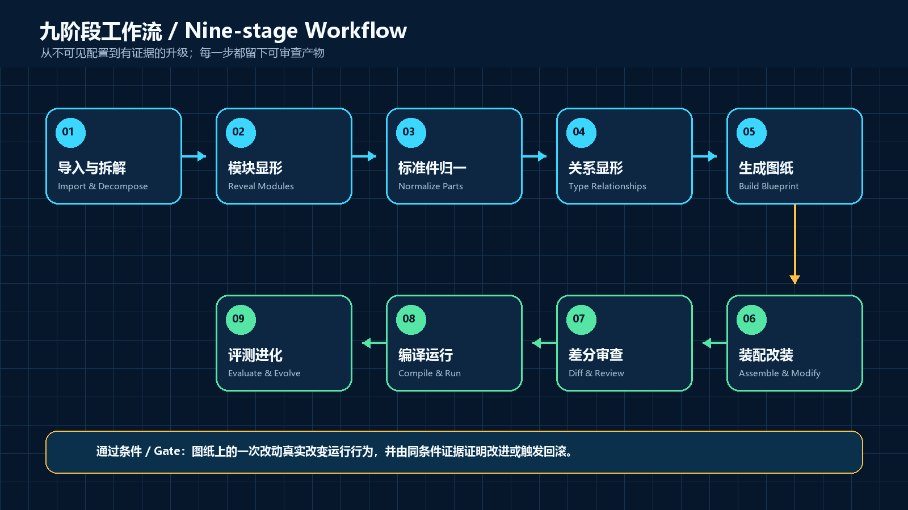
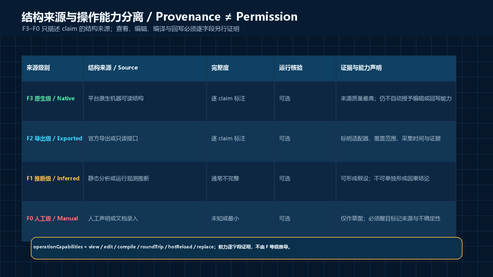
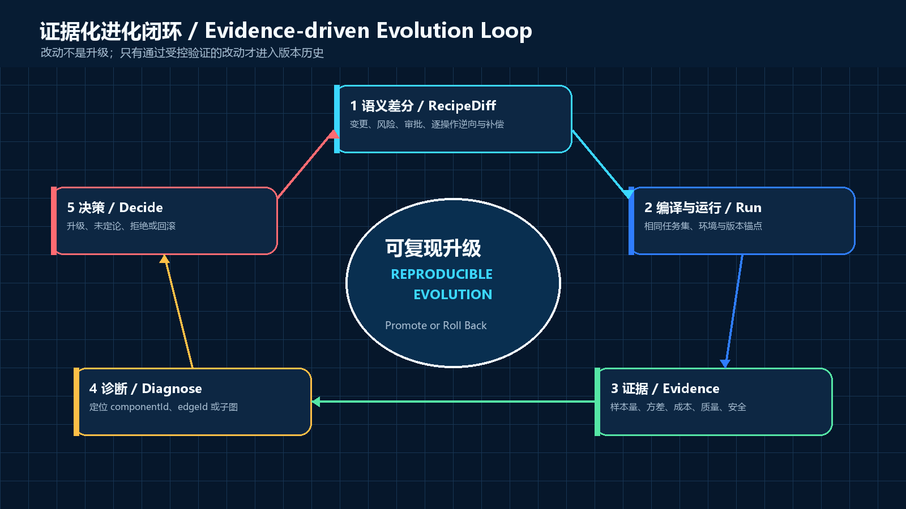

<!-- SPDX-License-Identifier: CC-BY-4.0 -->

# WGP Agent Bodification Flow (WGP-ABF)

## Agent Engineering Blueprints, Standardized Assembly Surfaces, and Evidence-Governed Evolution

**Version 0.5 — Bilingual Illustrated Public Draft**

**Originator and Principal Author: Wang Guangping (王广平)**

**Publication Date: August 27, 2026**

**Status: Public Draft; not an industry standard or certification program**


> WGP-ABF makes agent configuration a first-class engineering artifact that can be visualized, diffed, tested, modified, and validated.

In WGP-ABF, **Bodification** is a project-specific coined term for turning agent configuration into a typed, versioned, observable, and testable engineering assembly. It does not mean physical embodiment, personification, or biological modeling. The structural specification uses `Component`, `Edge`, `Container`, and `AssemblyRecipe`; “body” belongs only to optional human-facing visual projections.

> **Core proposition: diversity drives innovation; standard parts enable composition. WGP-ABF does not standardize internal implementations; it standardizes assembly surfaces.**

---

## Abstract

Modern agents combine models, tools, memory, sandboxes, permissions, approvals, subagents, runtimes, and external services. Generative programming is lowering implementation cost, but the engineering assets that require long-term maintenance now extend beyond source code to assembly recipes, evaluation sets, evidence, standard-part packages, and governance policies. Agent configuration and its implementation ecosystem still lack the semantic diffs, review, testing, attribution, interchangeability, and rollback mechanisms long available to source code.

WGP-ABF proposes a platform-neutral method for agent configuration engineering. It turns configuration into an artifact that can be deconstructed, edited, executed, evaluated, and diagnosed. The method defines three protocols and one blueprint discipline: the structure protocol uses WGP-ABIR and `AssemblyRecipe` to express canonical structure; the runtime protocol represents execution with events whose storage, origin, and replay roles are explicit; the evidence protocol constrains improvement claims through layered evaluation, statistical conditions, and diagnostic reports; and the two-dimensional engineering blueprint is the authoritative human editing projection of ABIR. Body and three-dimensional views are optional, read-only explanatory projections.

Version 0.5 adds a **standardized assembly surface** to the structural protocol. Implementers remain free to choose models, algorithms, languages, frameworks, and internal architectures. Interoperable concerns are published through `StandardPartDescriptor`, `StandardPartPackage`, `CompatibilityProfile`, `InterchangeabilityAssessment`, `ConformanceSuite`, `ConformanceReport`, `EvidenceStatusRecord`, `PartRegistry`, and `ReplacementPlan`. A Standard Part can map to any of the six ABIR kinds—`Component`, `Resource`, `Policy`, `Artifact`, `Interface`, or `Container`; a model, prompt, or resource MUST NOT be misrepresented as an executable component merely to enter a catalog. I0–I4 is recorded by a time-bounded directed assessment that states how far one exact Standard Part can replace another within fixed versions, content digests, a target environment, policy, and an evidence-validity window. It is fully orthogonal to F3–F0 structural provenance. Internal innovation can therefore remain diverse while composition gains inspectable interfaces, configuration, state, lifecycle, and rollback conditions.

The primary value of WGP-ABF is not reducing configuration input. It is improving understanding, composition, and attribution: reveal what a configuration actually assembles; discover candidate Standard Parts through open registries; turn a proposed replacement into a `ReplacementPlan` and reviewable `RecipeDiff`; and test whether the change improves results on the same task set under controlled conditions. A Core-conformant implementation MUST identify structural provenance, declare operation capabilities and provide interchangeability evidence independently, separate the three event axes, make every score traceable to source evidence, and prove that a blueprint edit can change the real runtime. DeepSeek Harness (DSH) is the first version-pinned adapter case, but it does not define the conceptual limits of the method.


**Figure 1 — System map.** WGP-ABIR and `AssemblyRecipe` form the canonical, versioned structural record; the two-dimensional blueprint is their authoritative human editing projection; Standard-Part objects describe composable assembly surfaces. Every view and marketplace entry MUST reference that same model and MUST NOT maintain a hidden second copy of the business structure.

---

## 1. Vision, Intended Users, and Non-goals

### 1.1 Vision

WGP-ABF aims to let general users understand an agent as naturally as they would read an assembly drawing, let developers review configuration as rigorously as they review code, let Standard-Part authors preserve freedom of internal innovation while publishing composable assembly surfaces, and let teams validate every replacement as a controlled experiment.

It establishes one continuous workflow:

1. import configuration from a real platform and identify the source of every item;
2. present components, interfaces, relationships, permissions, and containers in a two-dimensional engineering blueprint;
3. discover composable Standard Parts through standardized descriptors and registries without requiring identical internal implementations;
4. calculate an interchangeability level for the target environment and generate a `ReplacementPlan`;
5. express the modification as a readable, reviewable, and applicable `RecipeDiff`;
6. compile to the target platform, execute the conformance suite, and detect drift; and
7. collect runtime evidence under repeatable conditions, then promote, retain as an experiment, or roll back the change under bounded conclusions.

### 1.2 Intended Users

- General users who want to understand, modify, or combine agents.
- Product teams building Agent Studios, operations platforms, and visual editors.
- Open-source authors and vendors publishing Standard Parts, adapters, test suites, or registries.
- Security and governance teams that audit permissions, supply chains, extensions, and data flows.
- Engineers studying agent evaluation, diagnosis, and component interaction.
- Communities that want an open Standard-Part market without locking internal technology to one implementation.

### 1.3 Non-goals

WGP-ABF does not promise to unify the execution semantics of every platform. It does not standardize internal algorithms, languages, or frameworks; treat a humanoid appearance as structural truth; use architecture hiding as a substitute for security controls; claim that a single A/B comparison establishes causal attribution; or designate any one model, registry, or vendor as the only valid implementation. “Standard Part” does not mean that implementations converge. It means that the declared assembly surface can be checked by machines.

---

## 2. Problem Boundary and Design Principles

### 2.1 Eight Problems to Solve

1. **Invisible structure:** users see YAML, JSON, or forms, but not the complete assembly.
2. **Poor comparability:** equivalent concepts across platforms lack shared structural semantics.
3. **Poor reviewability:** a text diff does not reliably express which component changed or which path is affected.
4. **No reliable write-back:** many visualizations are read-only, and their edits cannot safely return to a real runtime configuration.
5. **Ambiguous replay:** incomplete events and unclear retention semantics blur the difference between interface replay and real re-execution.
6. **Weak attribution:** scores exist without a reference chain connecting them to source evidence and structural objects.
7. **Weak governance:** extension provenance, permissions, approval, compensation, and version drift lack a unified record.
8. **Poor portability:** useful implementations lack portable descriptors, content-addressed packages, compatibility profiles, executable conformance tests, and trustworthy registry records, preventing an open and verifiable Standard-Part market.

### 2.2 Seven Design Principles

- **Reality first:** every structural claim MUST state its provenance and coverage.
- **One model, multiple projections:** the machine-readable canonical record, 2D editing blueprint, and 3D presentation do not duplicate business facts.
- **Authority is separate from provenance:** F3–F0 does not automatically grant view, edit, compilation, or write-back authority.
- **Innovation is separate from assembly:** internal implementations remain open to competition; only cross-boundary ports, configuration, state, requirements, and lifecycle are standardized.
- **Declaration is separate from state:** the recipe describes desired configuration; runtime events describe what actually happened.
- **Evidence precedes promotion:** a modification enters a stable version only after satisfying predeclared gates.
- **Progressive complexity:** first-time users complete safe goals before experts expand fields, interchangeability levels, statistics, and governance details.

### 2.3 Standard Parts Across the Nine-Stage Workflow

The standardized assembly surface is not a marketplace extension outside the process. It is a verifiable object throughout the nine stages in Figure 2:

1. **Import:** collect ABIR, `SourceClaim`, and existing package identities.
2. **Module exposure:** identify replaceable boundaries and internal subgraphs that still require encapsulation.
3. **Standard-Part exposure:** generate or read a `StandardPartDescriptor` and map it to one of the six ABIR object kinds.
4. **Relationship exposure:** turn ports, protocols, Schemas, permissions, and lifecycle requirements into an assembly surface.
5. **Blueprint generation:** display the current part, candidates, and the I0–I4 evidence scope from `InterchangeabilityAssessment` on the same ABIR.
6. **Assembly modification:** query a `PartRegistry`, select a `CompatibilityProfile`, recompute `InterchangeabilityAssessment`, and generate a `ReplacementPlan`.
7. **Diff review:** compile the plan into a `RecipeDiff` that exposes permission changes, state migration, risk, and compensation.
8. **Compile and run:** resolve the digest-pinned `StandardPartPackage`, execute the `ConformanceSuite`, produce a `ConformanceReport`, and verify the lifecycle plan.
9. **Evaluate and diagnose:** rerun the real task set, publish scoped and time-bounded evidence, or roll back.



**Figure 2 — Nine-stage workflow.** Every stage leaves a reviewable artifact. The final gate is not merely “the part installed” or “the agent started”; the modification must change the real runtime and be supported by evidence gathered under comparable conditions, or trigger rollback when the gate is not met.

---

## 3. Normative Language, Versioning, and Conformance Levels

The Chinese terms corresponding to requirement, prohibition, recommendation, and permission are aligned with the RFC-style key words `MUST`, `MUST NOT`, `SHOULD`, and `MAY`. In this English edition, only sentences that explicitly use these uppercase words are normative; all other text is explanatory or advisory.

### 3.1 Versioning

- `specVersion`: the semantic version of the WGP-ABF machine specification.
- `schemaVersion`: the semantic version of one JSON Schema.
- `recipeVersion`: the monotonic version of one assembly recipe.
- `descriptorVersion`: the format version used by a Standard-Part descriptor.
- `definitionVersion`: the version of a Standard-Part definition.
- `adapterVersion`: the version of a platform adapter.

The whitepaper version **0.5** is a reader-facing version-series label. npm packages, validators, and machine-specification releases use SemVer **0.5.0**. Format values such as `wgp-abir/0.5`, `wgp-standard-part-descriptor/0.5`, `wgp-recipe-diff/0.5`, and `wgp-runtime-event/0.5` identify the **0.5 format compatibility family**, not an npm package version. Patch releases within a compatibility family MUST continue to accept existing valid documents; a breaking change requires a new format family. The immutable Git tag **`v0.5.0`** pins the Schemas, examples, and build artifacts for this release. Schema `$id` values MUST reference that tag rather than a movable branch.

Versions in the `0.y.z` range are public drafts. A breaking field or semantic change MUST increment the minor version; a patch release MUST NOT change the meaning of an existing valid document. Whitepaper 0.5, package and specification version 0.5.0, the `/0.5` format family, and Git tag `v0.5.0` refer to the same initial semantic baseline, but serve different purposes: document identification, tool distribution, compatibility decisions, and immutable release location. They are not interchangeable.

### 3.2 Tiered Core Conformance and Optional Projection Conformance

| Level | Name | Minimum requirements |
|---|---|---|
| C0 | Visual Explainer | A teaching or presentation prototype clearly labeled non-conformant; it MUST NOT claim runtime fidelity |
| C1 | Blueprint Conformance | Valid ABIR + AssemblyRecipe, strongly typed edges, per-object provenance, one canonical record, and an exportable representation |
| C2 | Operational Conformance | C1 + field-level capabilities, semantic diff, risk review, native compilation, runtime-binding verification, and rollback discipline |
| C3 | Evidence Conformance | C2 + three event axes, safe replay, evaluation uncertainty, claim maturity, object-level diagnosis, and comparable re-evaluation |

An implementation MUST publish its validator version, supported Schemas and adapter versions, exceptions, and evidence supporting its conformance claim. A polished body, Standard-Part market, or 3D view does not increase Core Conformance.

**Projection Conformance** is a separate, optional label. If an implementation provides 2D, body, or 3D projections, it MUST prove that each projection is generated from the canonical record, restrict editing to 2D fields with declared write-back support, and provide keyboard operation, text alternatives, and non-color status encoding. The absence of a body or 3D projection does not affect C1–C3.

An I0–I4 conclusion for a Standard Part is not the same as an implementation's C0–C3 conformance level. The former describes pairwise replacement evidence for candidates in a specific target. The latter describes which WGP-ABF responsibilities an implementation covers.

---

## 4. Normative Model: ABIR, Recipe, Evidence, and Projections

The sole canonical structural record in WGP-ABF is formed jointly by the **WGP Agent Blueprint Intermediate Representation (WGP-ABIR)** and **`AssemblyRecipe`**:

- **WGP-ABIR** represents objects, ports, relationships, source claims, and available operation capabilities.
- **AssemblyRecipe** represents compilable desired configuration, version anchors, and the target platform.
- **Evidence Store** preserves events, task results, artifact references, interchangeability evidence, and evaluation results.
- **ProjectionProfile** preserves layout, themes, body mappings, and accessibility descriptions.

Standard-Part objects do not create a second source of structural truth. `StandardPartDescriptor` maps through `partKind` to one of the six ABIR kinds, references ABIR ports, and publishes the assembly surface. `StandardPartPackage` binds a content-addressed implementation artifact. `CompatibilityProfile` defines stable rules and environment requirements, while `InterchangeabilityAssessment` records one directed, time-bounded pairwise conclusion. `ConformanceSuite` and `ConformanceReport` respectively state how to test and what was observed; `ReplacementPlan` states how to replace. `PartRegistry` indexes only versioned objects with immutable digests. An executable `partKind: component` MAY have a narrower tool view, but it MUST NOT introduce another descriptor root Schema.

`AssemblyRecipe.standardPartBindings[]` selects exact `descriptorRef` and `packageRef` values and records `partKind`, `targetObjectId`, configuration, and `surfaceMappings`. Each surface mapping connects a Standard-Part port to an ABIR target port through `partPortId → targetPortId`. A binding selects and maps canonical objects; it MUST NOT maintain a second copy of object or port facts.

`ProjectionProfile` MUST NOT become a required field of a `Component`. Visual identifiers such as `arm.browser` MUST NOT enter the core type system. Layout changes, marketplace ranking, and recommendation results MUST NOT change recipe semantics.

### 4.1 Core Object Categories

| Category | Purpose | Examples |
|---|---|---|
| `Component` | A replaceable, configurable, independently observable runtime unit | Model provider, memory retriever, tool executor |
| `Resource` | Data or capability resources read or written by components | Vector store, file system, model credential reference |
| `Policy` | Constraints enforced outside the model | Network policy, approval rule, budget limit |
| `Artifact` | Addressable runtime, package, or evaluation output | Package, patch, report, screenshot, log excerpt |
| `Interface` | Port, protocol, or service definition | Chat completion, tool call, RPC |
| `Container` | A unique containment hierarchy over objects | Subagent module, tool group |

Messages, prompts, task definitions, and policies SHOULD NOT all be disguised as `Component` merely because doing so is convenient for drawing or listing them in a registry.

### 4.2 Canonicalization and Identity

A conformant implementation MUST assign stable, namespaced IDs to objects. JSON used for hashing, signatures, or caching SHOULD use deterministic canonicalization; RFC 8785 JSON Canonicalization Scheme is recommended. Containment MUST have one authoritative representation and MUST NOT be maintained simultaneously through `Container.contains` and duplicate containment edges.

Cross-recipe, descriptor, Standard-Part package, and registry references MUST pin both a version and a content digest. Import MUST fail with a localized diagnostic when a reference cannot be resolved, a digest mismatches, an undeclared recursive cycle is present, or IDs collide. A registry display name or download count MUST NOT substitute for content identity.

A JSON document with a root `contentHash` or `recordHash` MUST use a non-recursive self-digest rule: remove the root digest field being calculated, canonicalize the remaining document under RFC 8785, and compute SHA-256 over the canonical UTF-8 bytes. Exact references use that result. An implementation MUST NOT hash a placeholder value or recursively include the digest field itself in the digest input.

---

## 5. Structural Provenance: Fidelity Is Not Authority or Interchangeability

F3–F0 remains a clear interface badge, but `structuralProvenance` describes only the structural source of one claim. It is not a trust conclusion, grants no operation authority, and does not imply interchangeability:

- **F3 Native:** obtained from a native, locatable, authoritative structural representation of the target platform.
- **F2 Exported:** obtained from a repeatable structural export produced by the platform or a versioned adapter.
- **F1 Inferred:** inferred through static analysis, runtime observation, or other evidence.
- **F0 Manual:** entered directly by a person without a higher-grade structural source.

In addition to the general claim identifier `id`, every `SourceClaim` MUST contain `subjectId`, `fieldScope`, `structuralProvenance`, `identityAssurance`, `fieldCoverage`, `runtimeEvidence`, `operationCapabilities`, `trustState`, `method`, and `observedAt`. `fieldScope` is the set of JSON Pointers covered by the claim. Identity stability, field coverage, runtime evidence, and trust state MUST be recorded separately; none may be inferred from the F level. `adapter`, `evidenceRefs`, and `expiresAt` are optional. An expired claim MUST NOT continue to serve as current evidence.



**Figure 3 — Provenance is separate from authority.** F3 Native does not imply editability or interchangeability, and F2 Exported does not imply “limited editability.” Operation capabilities require independent adapter and field-level evidence; I0–I4 is determined by the pairwise compatibility evidence in Section 12.

### 5.1 Operation Capabilities

`operationCapabilities` is the composable capability set that a `SourceClaim` assigns to all fields covered by its `fieldScope`. It MAY contain any compatible combination of:

- `view`: the fields can be displayed reliably;
- `edit`: a valid modification can be generated;
- `compile`: the fields can be compiled into target-platform configuration;
- `roundTrip`: export, modification, and write-back preserve the declared semantics;
- `hotReload`: the fields can take effect during a declared runtime phase without restarting the whole assembly; and
- `replace`: the target can be atomically replaced while preserving interface constraints.

These values describe technical capabilities proved by an adapter. They do not represent the current user’s authorization, deployment policy, approval outcome, or I level; an operation still requires all of those constraints. A capability MUST NOT be inferred from `structuralProvenance`, `trustState`, registry ranking, or a single runtime observation. The assembly interface SHOULD report a claim-coverage vector such as `F3 62% / F2 21% / F1 12% / F0 5%` rather than hide the distribution behind one minimum value. A critical path MUST be declared for a specific task.

---

## 6. Strongly Typed Graphs, Ports, Modules, and Standardized Assembly Surfaces

Structural edges MUST connect explicit ports rather than merely connect two boxes:

```text
sourceComponent + sourcePort
  -> edge(type, cardinality, schema, ordering, policyRefs)
  -> targetComponent + targetPort
```

At minimum, a port declares direction, data Schema, single- or multi-value cardinality, and synchronous or streaming semantics. A compiler MUST reject direction conflicts, incompatible data Schemas, unconnected required ports, and unauthorized permission expansion.

Recommended semantic relationship labels include:

- `data.flow`: a message or structured-data flow;
- `control.invoke`: an invocation or control relationship;
- `capability.consume`: a component consuming a capability;
- `policy.enforce`: a policy enforced on an object or edge;
- `artifact.produce`: a component producing an addressable artifact; and
- `evidence.support`: evidence supporting a claim or score.

These profile-level labels MUST map explicitly to the allowed core `edgeKind` values in the ABIR Schema; they do not extend that enum implicitly. `errorPropagation` belongs to a runtime or diagnostic projection and MUST NOT be conflated with a static structural edge.

A **standardized assembly surface** comprises public ports, protocols and Schemas, a configuration contract, capabilities and dependencies, permission requirements, state and migration, and the install/replace/rollback/uninstall lifecycle. Standardizing those cross-boundary facts does not constrain a Standard Part's internal algorithm, framework, model, or license. Only externally checkable facts enter the descriptor; private implementation details remain private.

A reusable subgraph is represented by a `ModuleDefinition`. A module instance MUST declare exposed ports, parameters, its internal version, and state-isolation semantics. A recursive module MUST declare depth, resource, and termination limits.

---

## 7. RecipeDiff, ReplacementPlan, Approval, Transactions, and Drift

A modification MUST first become a `ReplacementPlan` or another reviewable proposal and then compile to a `RecipeDiff`; it MUST NOT overwrite a file directly or execute a registry recommendation. `ReplacementPlan` describes the parts being exchanged, the required I level, configuration transformation, state migration, permission delta, execution steps, verification vectors, rollback, approvals, and evidence references. An applicable diff can be generated only while the plan's preconditions and evidence remain valid.

In addition to format, identity, creation time, and recipe identity, the core `RecipeDiff` fields are:

- `baseVersion` and `baseContentHash`: pin the recipe version and canonical content digest before the change;
- `targetVersion` and `targetContentHash`: pin the intended version and content digest after the change;
- `preconditions`: declare transaction-level recipe-version, content-hash, path-existence, or path-value preconditions;
- `operations`: an ordered list of atomic operations, each with its own `precondition` and `restartRequired`, plus an executable configuration inverse in `operations[].compensation`;
- `riskAssessments`: per-path risk category, severity, mitigation, residual risk, and risk approval;
- `compensation`: the transaction recovery strategy and, under `externalSideEffects`, the action, verification, idempotency, and owner for compensating each external effect; and
- `approval`: whether the overall transaction requires approval and its state; this does not replace the risk-specific approval in `riskAssessments[].approval`.

An operation-level configuration inverse, recipe rollback, compensation for an external side effect, and a genuinely irreversible action are four distinct concepts. `operations[].compensation` describes only the inverse operation on one `AssemblyRecipe` path. Recipe rollback applies those inverses in a safe order and verifies the target digest. Top-level `compensation.externalSideEffects` handles effects that have already occurred outside the recipe document. An action with neither a real inverse nor reliable compensation is irreversible and MUST NOT be disguised as recoverable with a no-op.

The compiler MUST be deterministic and idempotent, and MUST verify the prerequisite recipe digest and package digests before applying a diff. Atomic application either commits every operation or leaves the target unchanged. A target platform without atomic application MUST report its partial-failure semantics and recovery points explicitly. The system SHOULD re-import before and after application to detect semantic drift.

Irreversible operations MUST be denied by default. The Core Schema cannot label a no-compensation action “safely recoverable.” A deployment extension MAY allow it only under explicit policy, separate `riskAssessments` disclosure, independent approval, and an audit record naming the non-reversible result.

---

## 8. Runtime Events, Causal Ordering, and Three Replay Modes

At minimum, the `RuntimeEvent` envelope contains:

```json
{
  "format": "wgp-runtime-event/0.5",
  "eventId": "44444444-4444-4444-8444-444444444444",
  "runId": "run.example-01",
  "sessionId": "session.example-01",
  "sequence": 12,
  "eventType": "tool.completed",
  "occurredAt": "2026-08-27T08:00:00Z",
  "observedAt": "2026-08-27T08:00:00.042Z",
  "producer": {"name": "adapter.dsh", "version": "0.5.0", "instanceId": "runtime.local-01"},
  "subject": {"abirId": "agent.example", "objectId": "component.tool.browser", "recipeId": "recipe.example"},
  "trace": {"traceId": "0123456789abcdef0123456789abcdef", "spanId": "0123456789abcdef"},
  "storageClass": "durable",
  "origin": "primary",
  "replayRole": "expectedOutcome",
  "payload": {},
  "redaction": {"state": "none", "removedFields": []}
}
```

The three event axes MUST remain independent:

| Axis | Values | Meaning |
|---|---|---|
| `storageClass` | `durable / ephemeral` | Whether the event enters a durable record or exists only in the live session |
| `origin` | `primary / derived` | Whether this is a primary observation or a deterministic derivative of other events |
| `replayRole` | `input / expectedOutcome / verificationOnly / projectionOnly / excluded` | Whether the declared replay consumes, compares, verifies, projects, or excludes the event |

A derived event may be durable, and an ephemeral event may be a primary observation. If `tool.started` records an actual start time, it is a primary event; it does not become derived merely because the interface could infer it. Replacement, migration, verification, and rollback events MUST reference the `ReplacementPlan`, descriptor version, and package digest so that the exact Standard Parts used at runtime can be reconstructed.

An implementation MUST distinguish:

1. **View Replay:** reconstructs the interface using recorded facts only;
2. **Simulation Replay:** validates interfaces and paths with fixed dependencies or a recorded model stream; and
3. **Re-execution:** invokes real components again, so results may change and a new event chain is produced.

Factual replay input comes from `durable + primary` events or access-controlled encrypted references to them. A derived layer MUST be reproducible by its declared deterministic function and, where represented as a derived event, use `derivation.sourceEventIds`. Event processing MUST also define policies for duplicate delivery, out-of-order and late events, clock skew, persistence failure, and checkpoints before external side effects.

Privacy takes priority over preserving every plaintext payload. A system MAY retain an input manifest, digest, or access-controlled encrypted reference, but it MUST state retention, deletion, key-management, and tenant-isolation semantics.

---

## 9. Observability and Open Mappings

WGP-ABF does not replace OpenTelemetry. Implementations SHOULD align `traceId / spanId` with OpenTelemetry traces and carry WGP object IDs, recipe digests, Standard-Part package digests, replacement plans, and evidence references as semantic attributes. Generative AI semantic conventions continue to evolve; an adapter MUST pin the version or commit it implements and MUST NOT claim to use an unspecified “latest” version.

Telemetry collection MUST follow these rules:

- keep normalized-event namespaces separate from native platform-event namespaces;
- publish and version transformation rules, including any semantic loss;
- redact sensitive fields by default, and never place secret values in ordinary logs;
- preserve explicit references when events and structural objects or Standard-Part identities have many-to-one or one-to-many relationships rather than inventing one-to-one identity; and
- let scores, interchangeability evidence, and diagnoses reference stable evidence IDs instead of copying drift-prone log text.

---

## 10. Evaluation Design, Statistical Protocol, and Attribution Limits

WGP-ABF records two orthogonal dimensions: the **unit of evaluation** and the **evidence design**.

### 10.1 Units of Evaluation

- `eval.component`: validates one component's interface, local quality, cost, and safety.
- `eval.assembly`: validates interactions within a module or subgraph.
- `eval.agent`: validates complete-agent task outcomes and user experience.

A Standard Part MAY have both a **Standalone Performance Score** and an **In-Assembly Contribution Score**. They are not interchangeable. I1 says only that an adapter exposes a standardized assembly surface; I2 establishes interface conformance; I3 records behavior verification in a bounded environment. None of these levels establishes higher outcome quality. I4 closes migration, acceptance, and rollback evidence within its declared scope, but still does not prove improved task performance.

### 10.2 Evidence Designs

1. **Contract regression:** fixes a model stream or dependency to validate interfaces, events, and runtime paths.
2. **Paired behavioral evaluation:** uses paired real samples on the same tasks and environment to estimate a behavioral difference.
3. **Factorial or interaction evaluation:** uses a factorial design when multiple components interact, or explicitly declines single-part attribution.
4. **Observational diagnosis:** finds associations and proposes hypotheses; it MUST NOT present them as validated root causes.

`ConformanceSuite` belongs to contract and lifecycle evidence; `EvaluationRun` belongs to task-outcome evidence. A fixed model stream can reduce model-output variation, but cannot make whole-system variance “near zero” and cannot by itself prove that a Standard Part caused a change in final quality. If a modification changes context, tool results, or call IDs, the old stream may no longer be valid.

### 10.3 Minimum Statistical Record

Every comparable Scorecard MUST record metric definitions, the independent sampling unit, task-set version, pairing method, repetition count, effect size, variance estimate, confidence-interval method, significance level, prespecified power, minimum detectable effect (MDE), outlier and missing-data rules, stopping rule, evaluator version, and inter-rater agreement for human labels.

Safety, privacy, and authorization measures are gates that an aggregate quality score cannot offset. Cross-platform behavioral scores MAY be compared, but part-level attribution MUST show both parties' claim coverage, compatibility profile, and evidence strength.

---

## 11. Diagnostic Hypotheses, Intervention Validation, and Improvement Decisions

A diagnostic report MUST NOT label a correlated observation directly as `rootCause`. It uses:

- `suspectedCause`: supported by evidence but not yet tested by an intervention;
- `testedCause`: evaluated through a preregistered intervention;
- `validatedCause`: the effect passes the gate and alternative explanations are controlled; or
- `rejectedCause`: the intervention does not support the hypothesis.

Every diagnosis MUST reference a `partId`, `componentId`, `edgeId`, or subgraph, symptom events, comparison evidence, and uncertainty. A diagnosis MAY query a `PartRegistry` for candidates, but recommendation ranking MUST NOT be presented as a root cause or promotion conclusion. A change decision has exactly four states: `promote`, `hold`, `reject`, or `rollBack`. “No significant decline detected” MUST NOT be rewritten as “improved.”



**Figure 4 — Evidence-backed improvement loop.** “Evolution” in this document means a reproducible improvement process controlled by a person or governance policy. A diagnosis produces a `ReplacementPlan`; only after the plan passes assembly-surface checks, diff review, verification, and real-task evaluation may the system promote or roll back the change. The system MUST NOT rewrite itself without authorization.

---

## 12. Standardized Assembly Surfaces, Interchangeability Levels, and the Open Market

This section limits “Standard Part” to **standardization of an assembly surface**. An ABIR object may use entirely different internal code, models, data structures, or business models. It can participate in composition when it publishes a verifiable assembly surface and passes the tests declared for its scope. A Standard Part is neither a uniform implementation nor an approval badge granted by a central registry.

### 12.1 Nine Standard-Part Protocol Objects

| Object | Responsibility | Key content |
|---|---|---|
| `StandardPartDescriptor` | Identifies a versioned Standard Part, maps it to ABIR, and describes how it connects, configures, and operates | Identity, assembly, configuration, capabilities, requirements, state, exact package/profile/suite references, and lifecycle |
| `StandardPartPackage` | Provides the immutable implementation artifact selected by a descriptor's `packageRef` without referring back to the descriptor | Package identity, exact artifact reference, locator, media type, source provenance, SBOM, license, and signature |
| `CompatibilityProfile` | Defines reusable target-kind, environment, assembly-surface, and replacement rules | Runtime constraints, required surfaces, dependency/permission/state/configuration policies, allowed modes, and required suite references |
| `InterchangeabilityAssessment` | Records one time-bounded `source → target` conclusion under a fixed profile and environment | Exact source/target/profile/environment references, `assessedLevel`, `levelEvidence`, `assessedAt`, `expiresAt`, and an optional plan reference |
| `ConformanceSuite` | Defines executable positive, negative, protocol, and lifecycle tests | Suite identity, content digest, specification version, test vectors, and expected results |
| `ConformanceReport` | Records the environment, results, and verifiable evidence from one suite execution | Exact suite/part/profile/environment references, content hash, `executedAt`, executor, results, summary, and `expiresAt` |
| `EvidenceStatusRecord` | Uses an external append-only record to decide whether an immutable report is currently admissible as evidence | Status-record identity, exact report reference, contiguous revision, record and previous hashes, action, `recordedAt`, and reason |
| `PartRegistry` | Indexes descriptors, digests, publication, revocation, and tombstones through append-only records | Registry identity, revision, record and previous hashes, action, status, `recordedAt`, exact part reference, and reason |
| `ReplacementPlan` | Turns a candidate into a reviewable, executable, acceptable, and reversible replacement | Exact source and target references, profile reference, replacement mode, recipe precondition, risk, adapter capabilities, migration/acceptance/rollback reports, failure policy, and steps |

`StandardPartDescriptor` uses `format: wgp-standard-part-descriptor/0.5` and `descriptorVersion: 0.5.0`. Its root fields are `format`, `descriptorVersion`, `contentHash`, `createdAt`, `identity`, `assembly`, `configuration`, `capabilities`, `requirements`, `state`, `packageRef`, `compatibilityProfileRefs`, `conformanceSuiteRefs`, and `lifecycle`, with optional `extensions`. Its identity contains `partId`, `name`, `version`, `partKind`, `publisher`, and `releaseChannel`; `partKind` is exactly one of `component | resource | policy | artifact | interface | container`, corresponding to the six ABIR kinds. Every cross-document reference MUST pin both a version and a content digest. The exact Standard-Part reference is `{partId, version, contentHash}`. Assembly ports MUST reference ABIR and MUST NOT create an independent set of port facts.

A descriptor can reference only a Package, Profile, or Suite that is predefined and does not exact-reference the descriptor in return. Later `ConformanceReport`, `InterchangeabilityAssessment`, and `ReplacementPlan` documents MUST point to the immutable descriptor through an exact part reference and be discovered in reverse through `PartRegistry` or a query index. Neither the descriptor nor its `lifecycle` may refer back to those three later document types, because such links would create an uncomputable bidirectional hash cycle.

`StandardPartPackage` pins its implementation artifact through `artifactRef: {artifactId, version, contentHash}`, `locator`, and `mediaType`, and records `supplyChain`, `license`, and `signature`. A signature proves only that a named signer made a statement about a named digest; it does not by itself establish code safety, license correctness, or fitness for a task.

`ConformanceSuite` defines only the specification version, content digest, required or optional test vectors, and expected results. `ConformanceReport` is immutable execution evidence produced against an exact Standard Part, Profile, executor, and environment, and records its expiry. A suite cannot attest that it has passed itself; a passing report establishes only the declared contract, not universal task quality. Withdrawal takes effect only through a later external, append-only `EvidenceStatusRecord` that exact-references the report. An implementation MUST NOT rewrite or rehash the published report.

`CompatibilityProfile` does not store an I level. `InterchangeabilityAssessment` MUST pin `assessmentId`, `version`, `contentHash`, `sourcePart`, `targetPart`, `profileRef`, `environmentRef`, `assessedLevel`, `levelEvidence`, `assessedAt`, and `expiresAt`; I4 also requires an exact `replacementPlanRef`. Changing direction, Profile, environment, version, digest, or the evidence window invalidates the old Assessment and requires recomputation.

### 12.2 I0–I4 Interchangeability Levels

An I level is stored in `InterchangeabilityAssessment.assessedLevel`. It is a **pairwise conclusion** for `A → B` within a fixed `CompatibilityProfile`, target runtime environment, policy, versions and content digests, and evidence-validity window. It is not an intrinsic, permanent badge attached to either the Profile or a Standard Part. `levelEvidence` is cumulative: every level must satisfy every lower-level gate, and a machine may derive only the highest level whose complete required evidence remains valid. An Assessment MUST NOT self-report an `assessedLevel` above that machine-derived ceiling.

A `ConformanceReport` is admissible to `levelEvidence` only when its exact part/Profile/Suite/environment references match, every required vector passed, `expiresAt` has not elapsed, and no later `EvidenceStatusRecord` has revoked or tombstoned it:

| Level | Name | What has been established | What has not been established |
|---|---|---|---|
| **I0 Closed** | Closed | The exact Standard-Part identity is known, but `levelEvidence` does not yet satisfy I1 | No guarantee of an inspectable standardized assembly surface, connectability, or replaceability |
| **I1 Adapter-wrapped** | Adapter-wrapped | I0 + `levelEvidence` contains admissible reports proving that a version-pinned, content-addressed adapter exposes the Profile-required surfaces and ports | No guarantee that protocol, Schema, configuration, dependencies, or permissions fully conform |
| **I2 Interface-conformant** | Interface-conformant | I1 + `levelEvidence` proves that all required interface and configuration vectors passed, and that surfaces, port directions, protocols, Schemas, cardinalities, runtime requirements, dependencies, and permissions satisfy the Profile | No guarantee that behavior has been verified in the target environment or that state can migrate safely |
| **I3 Behavior-verified** | Behavior-verified | I2 + `levelEvidence` contains an admissible `ConformanceReport` from the target environment in which every required `behavioral` test vector passed | No guarantee of state migration, controlled replacement, rollback, or non-regression on real tasks |
| **I4 Evidence-backed controlled interchangeability** | Evidence-backed controlled interchangeability | I3 + the Assessment has an exact `replacementPlanRef`, and cumulative `levelEvidence` contains admissible reports proving migration, controlled switchover and acceptance, and rollback all passed | Does not imply hot reload, permanent certification across environments, universal task-outcome equivalence, or inevitable quality improvement |

F3–F0 answers “where did this structural information come from?” I0–I4 answers “under what conditions can these exact Standard Parts be exchanged, and how far?” An F value MUST NOT populate `assessedLevel`, and an I value MUST NOT replace `SourceClaim`. I4 still cannot replace an `EvaluationRun` on a real task set, and it does not imply `hotReload`. The implementation may restart, perform a rolling replacement, or hot-reload; `ReplacementPlan.replacementMode` and the adapter's field-scoped `operationCapabilities` declare the actual method.

### 12.3 Free-Assembly Formula and Replacement Planning

“Free assembly” does not mean connecting arbitrary Standard Parts indiscriminately. It means that explicit constraints remove the need to invent a private adapter rule for every combination. For Standard Part A, candidate B, and target environment and policy T, the minimum predicate for actually applying the replacement is:

```text
FreeAssembly(A, B, T) =
  SurfaceMatch
  ∧ RuntimeSatisfied
  ∧ DependenciesSatisfied
  ∧ PermissionsGranted
  ∧ AssessedLevel(A, B, T) ≥ T.requiredLevel
  ∧ ConformanceEvidenceValid
  ∧ LifecyclePlanAvailable
```

This predicate applies only to an actual assembly or replacement. I0 cataloging and I1 adapter design do not require a complete lifecycle plan. Once apply/replace begins, `LifecyclePlanAvailable`, pinned versions and digests, permissions, resources, evidence validity, and rollback conditions are hard gates. I4 additionally requires migration, acceptance, and rollback `ConformanceReport` records that satisfy the admissibility conditions above.

`ReplacementPlan` MUST pin `planId`, `version`, `contentHash`, `profileRef`, `fromPart`, `toPart`, `replacementMode`, `recipePrecondition`, `riskAssessmentIds`, `requiredAdapterCapabilities`, `migrationReportRefs`, `acceptanceReportRefs`, `rollbackReportRefs`, `failurePolicy`, and `steps`; it MUST NOT contain a reverse `recipeDiffRef`. After the Plan becomes immutable, only `RecipeDiff.replacementPlanRef` points to it through an exact reference. The Plan MUST NOT point back to the Diff, avoiding a bidirectional hash cycle. Only `replacementMode: hotReload` requires the adapter's `operationCapabilities` to contain `hotReload` for the affected `fieldScope`. If a digest, permission, evidence record, or recipe precondition ceases to hold, the Assessment MUST be recomputed; an old I level MUST NOT be reused.

### 12.4 Standard-Part Market and Open Governance

The minimum marketplace object is not a download URL. It is a descriptor, content-addressed package, compatibility profile, time-bounded interchangeability assessment, conformance evidence, and lifecycle plan. A market MAY display use cases, license, permission changes, cost, maintenance state, and applicable targets, but MUST NOT present download counts, commercial ranking, or paid placement as interchangeability evidence.

`PartRegistry` is an index, not a unique trust root. Every publish, revoke, or tombstone action MUST create an append-only revision linked through `recordHash` and `previousRecordHash`; revocation and tombstones MUST NOT silently overwrite history. Public, enterprise, and personal registries may coexist. Users SHOULD be able to export descriptors and package digests and verify them through another registry or offline. Open governance includes namespace and publisher verification, immutable versions, signatures and SBOMs, revocation and security advisories, reproducible test vectors, evidence expiry, dispute handling, public RFCs, machine-executable compatibility suites, and mirror protocols that do not lock the ecosystem to one market.


**Figure 5 — Standard-Part ecosystem.** Diverse internal implementations publish verifiable Standard-Part packages through a common assembly surface. Registries provide discovery; compatibility profiles define rules; interchangeability assessments, conformance suites, and execution reports establish bounded evidence; `ReplacementPlan` and `RecipeDiff` govern execution and rollback; and `EvaluationRun` determines real-task outcomes.

---

## 13. A Progressive Experience for General Users

Visualization does not mean placing every field on a canvas. A conformant product experience SHOULD provide three layers:

### 13.1 Goal Layer

The user selects a goal such as “use the network more safely,” “add long-term memory,” “change the model,” or “reduce cost.” The system explains the expected change, each candidate Standard Part's current assessed I level and scope, permission and cost deltas, evidence freshness, and whether a restart is required in plain language. A market recommendation MUST NOT be applied automatically by default.

### 13.2 Blueprint Layer

The user sees components, relationships, permissions, the current part, and candidates. A guided flow handles safe preset modifications. Before requesting confirmation, every change shows its `ReplacementPlan`, semantic diff, affected scope, state migration, and recovery capability.

### 13.3 Expert Layer

Developers can expand port Schemas, `SourceClaim`, `StandardPartDescriptor`, raw events, conformance vectors, statistical plans, compiler diagnostics, and native platform configuration. Expert details and first-time-user views MUST reference the same object IDs, versions, and content digests.

A beginner mode MUST NOT use animation to hide real waiting, present I4 as “guaranteed better,” or package a high-risk action as an ordinary switch. An error message MUST identify the failed object, the failed gate, available actions, and whether the current configuration changed.

---

## 14. Two-Dimensional Blueprints, Body Projections, and Accessibility

The two-dimensional engineering blueprint is the authoritative editing surface, while ABIR and `AssemblyRecipe` remain the canonical record. Every canvas edit MUST generate a `RecipeDiff`. A field without verified write-back MUST remain read-only and explain why. The current part, candidates, I level, and evidence expiry MUST use both text and graphical encoding.

Humanoid, photorealistic, anime, pixel-art, or 3D appearances can help general users understand an agent, but they belong only in `ProjectionProfile`. The same Standard Part may map to different visual regions in different themes; a projection MUST NOT change `partKind`, interchangeability level, or registry identity in reverse.

At minimum, projections SHOULD support:

- keyboard-only selection, inspection, candidate comparison, diff review, and application;
- risk, status, F-level, and I-level encoding that does not depend on color;
- text alternatives for nodes, relationships, charts, and Standard-Part evidence;
- zoom, reduced motion, and high contrast; and
- a 2D or list-based path for every function when 3D is unavailable.

---

## 15. Threat Model, Supply Chain, and Data Governance

Security boundaries in WGP-ABF MUST be enforced outside the model by policy engines, the operating system, sandboxes, and server-side permissions. Hiding ABIR, descriptors, or registries is not a substitute for a security control.

A Core-conformant deployment SHOULD address:

- prompt injection and indirect prompt injection;
- malicious Standard-Part packages, dependency compromise, typosquatting, and supply-chain substitution;
- registry poisoning, forged compatibility profiles, expired evidence, and continued distribution of revoked versions;
- server-side request forgery, cross-site scripting, and uncontrolled network access;
- secret or log leakage and cross-tenant data access;
- tampering with or replay of blueprints, recipes, descriptors, events, and telemetry; and
- approval bypass, privilege escalation, and irreversible external side effects.

Standard Parts and recipes SHOULD record provenance, license, digest, signature or attestation, SBOM reference, and revocation state. A signature, a registry trust policy, and a conformance test are distinct evidence; none replaces the others. By default, an agent MUST be limited to a minimized, redacted capability manifest. Reading the complete authority graph or installation package requires an independent permission check, audit record, and tenant-isolation policy.

Any replacement that changes network, file, credential, external-publishing, or billing capability MUST be displayed as a separate high-risk capability in the `ReplacementPlan` and diff. Removing an entry from a registry cannot revoke a locally installed package; deployments MUST support digest blocking and an explicit revocation policy.

---

## 16. Versioned DeepSeek Harness Adapter Case

This section presents only a reviewable reference mapping. It does not imply that every DSH object is inherently F3 or I4, or that WGP-ABF is subordinate to DSH.

Verification anchors for this edition:

- repository: `pingta-guangpingwang/deepseek-harness`;
- locally verified commit: `0672d5ddfaf7d675d8e8bb37f69072bd98b5b0f7`;
- nearest tag relationship: the verified commit is one commit after `dsh-v0.1.1-rc.2`, described as `dsh-v0.1.1-rc.2-1-g0672d5ddf`; and
- verification date: August 26, 2026.

DSH provides a strong foundation for declared-configuration and event adapters through `--dump-config`, generated configuration, tool, and module catalogs, and the durable `SessionEvent` catalog. Configuration rows, service registrations, tool contributions, and runtime entities may still have one-to-many relationships, so an adapter MUST establish a binding for each object or claim. Only fields that can be reconstructed from declared configuration and pass adapter tests MAY be marked F3 with `roundTrip` capability.

Executable DSH plugins can map to `StandardPartDescriptor` and `StandardPartPackage` with `partKind: component`. Models, prompts, Skills, and other assets SHOULD instead map to `resource`, `artifact`, or another ABIR kind according to their actual semantics. The adapter MUST explicitly publish ports, configuration, permissions, state, and lifecycle; it MUST NOT infer an I level from “everything is a plugin.” Two plugins receive a pairwise interchangeability conclusion only under a target profile, pinned digests, a compatibility profile, and verification evidence.

DSH `SessionEvent` and live Cordis events are separate event spaces; mappings MUST preserve their namespaces. `assistant/chunk` is a streaming fragment, not a complete `model.completed` event, and `turn/end` does not necessarily mark the end of an entire run. Hot reload MUST be described through a declared reload strategy, in-flight behavior, restart conditions, and the applicable field-scoped `operationCapabilities`.

A reference compiler can compile the write-back-capable ABIR subset and a gated `ReplacementPlan` into a profile patch. Evidence, layout, inferred relationships, marketplace metadata, and diagnostic results MUST NOT be written back incorrectly as native platform configuration.

---

## 17. Implementation Roadmap and Acceptance Criteria

The nine-stage workflow in Figure 2 is implemented through the single milestone table below. Other documents SHOULD reference this table and MUST NOT maintain a second P0–P6 definition.

| Stage | Deliverable | Acceptance criterion |
|---|---|---|
| P0 Specification Foundation | Core Schemas, terminology, valid and invalid examples | Schemas are executable; Chinese and English object names align |
| P1 Import and Read-only 2D | At least one version-pinned adapter, source claims, and 2D rendering | Unsupported semantics and information loss remain visible |
| P2 Events and Replay | Event envelope, View Replay, and evidence references | Policies for disorder, duplicates, missing events, and privacy pass tests |
| P3 Diff and Write-back | RecipeDiff, dry run, approval, compilation, and drift detection | One blueprint edit changes real configuration and can be recovered safely |
| P4 Standard-Part Vertical Slice | StandardPartDescriptor, StandardPartPackage, Profile, Assessment, Suite, Report, PartRegistry, and ReplacementPlan | Two different implementations complete pairwise I0–I3 verification while retaining different internal technologies |
| P5 Evaluation and Diagnosis | Three evaluation units, Scorecard, I4 evidence, hypothesis states, and decisions | Statistical plan is preregistered; every score and I4 conclusion resolves to evidence and declares its scope |
| P6 Optional Projections and Open Ecosystem | Body/3D views, federated registries, compatibility suites, and community Standard Parts | Core functions do not depend on 3D or one market; independent implementations interoperate |

A stage MUST NOT satisfy its acceptance criteria by fabricating F3 or I4, dropping unfavorable runs, changing the control task set, bypassing lifecycle gates, or using an aggregate score to conceal a security regression.

---

## 18. Open Ecosystem, Governance, Intellectual Property, and Conclusion

### 18.1 Open Governance and Intellectual Property

WGP-ABF was conceived and first authored by Wang Guangping in 2026. Version 0.5 uses a file-scoped dual-license model:

- whitepapers, README files, governance documents, and original diagrams: **Creative Commons Attribution 4.0 International (CC BY 4.0)**;
- Schemas, examples, build scripts, and reference code: **Apache License 2.0**; and
- the WGP-ABF name, logo, and any future compatibility or certification marks: not granted by those licenses and governed by `TRADEMARKS.md`.

The open licenses do not transfer the author's copyright in the original work. They grant the public permission to copy, modify, and use the work subject to their terms. Copyright protects the text, diagrams, and specific expression in this document; it generally does not create an exclusive right over an abstract idea, method, or process. Brand protection, patent eligibility, and jurisdiction-specific rules require separate professional legal advice.

Standard-Part specifications, registry protocols, and conformance suites SHOULD evolve through public RFCs. Governance MUST NOT require open-sourcing a Standard Part's internals or make listing in one registry a condition of conformance. A public marketplace entry must still meet its disclosure duties for license, provenance, digest, permissions, and evidence. Every breaking change MUST update the Schemas, valid examples, invalid examples, migration notes, and both language editions together.

Before v1.0, if a Chinese-English difference cannot be reconciled immediately, the original Chinese edition is the temporary interpretive source and a public translation issue MUST be opened. Machine-verifiable semantics are governed by the Schemas and conformance tests.

Canonical repository: [pingta-guangpingwang/wgp-agent-bodification-flow](https://github.com/pingta-guangpingwang/wgp-agent-bodification-flow). Specification defects, interoperability problems, translation differences, and change proposals SHOULD be filed in the public [Issues](https://github.com/pingta-guangpingwang/wgp-agent-bodification-flow/issues), citing the affected format compatibility family, Schema `$id`, or immutable Git tag.

### 18.2 Conclusion

The agent ecosystem should not obtain composition by standardizing internal implementations. Models, algorithms, languages, frameworks, interfaces, and business models need continued divergence to sustain innovation. Ports, configuration, state, permissions, dependencies, package identity, lifecycle, tests, and replacement evidence need standardization to sustain reliable composition.

The conclusion of WGP-ABF v0.5 is therefore: **diversity drives innovation; standard parts enable composition. Do not standardize internal implementations; standardize assembly surfaces.** Free assembly is not unconditional drag-and-drop. It means that Standard Parts can be discovered, compared, replaced, validated, and rolled back when versions, digests, environment, policy, permissions, resources, interchangeability level, valid evidence, and lifecycle plan are all checkable. General users gain understandable choices; developers gain reviewable engineering objects; Standard-Part authors retain freedom to innovate; and open-source communities gain a market and governance foundation that is not tied to one platform.

---

## Appendix A: Minimum Interoperable Objects

A Core Conformance document contains at least:

1. `AbirDocument`: specification version, objects, ports, edges, `SourceClaim` records, and projection references;
2. `AssemblyRecipe`: target platform, desired configuration, version anchors, and compilation capabilities;
3. `RecipeDiff`: `baseVersion`, `baseContentHash`, `targetVersion`, `targetContentHash`, `preconditions`, `operations`, `riskAssessments`, `compensation`, `approval`, and the one-way exact `replacementPlanRef`;
4. `RuntimeEvent`: causal identity, the three event axes, object references, and artifact references;
5. `EvaluationRun`: task set, environment, comparison, metrics, statistical plan, and evidence;
6. `StandardPartDescriptor` and `StandardPartPackage`: six-kind ABIR mapping, standardized assembly surface, pinned implementation artifact, and supply-chain identity;
7. `CompatibilityProfile`, `InterchangeabilityAssessment`, `ConformanceSuite`, and `ConformanceReport`: stable rules, a time-bounded directed I level, test definitions, and executed evidence; and
8. `PartRegistry` records and `ReplacementPlan`: portable discovery metadata and a reviewable replacement proposal.

The repository provides JSON Schemas in `spec/` and a minimum closed-loop example in `examples/minimal-agent/`. If a Schema and this document conflict, the conflict MUST become a specification Issue; an implementation MUST NOT choose one silently.

## Appendix B: Claim Maturity

| Level | Permitted wording | Prohibited wording |
|---|---|---|
| Observation | “Co-occurs with the failure”; “warrants investigation” | “Caused the failure” |
| Regression | “Preserves/breaks this interface path” | “Improves final agent quality” |
| Controlled comparison | “The average difference under these tasks and conditions is…” | “Improves performance universally” |
| Validated causal claim | “The preregistered intervention supports this claim after controlling stated alternatives” | “Perfect attribution” |

I0–I4 describes interchangeability evidence, not claim maturity. Even an I4 replacement requires a separate Observation, Regression, Controlled comparison, or Validated causal claim for conclusions about task quality, user value, or cost-benefit.

## Appendix C: Normative Release Checklist

Every versioned release MUST record the results of the following specification checks. Any failing item MUST be listed as a known limitation in the Release notes; silence or an unfinished checklist is not an acceptable substitute:

1. Chinese and English titles, section numbers, figure numbers, Replay names, F/I levels, and glossary terms align.
2. Schemas accept every valid example and reject the versioned representative invalid examples.
3. Standard-Part examples cover valid I0–I4 paths, downgrade paths, and counterexamples that prevent level skipping.
4. Every figure has a source, prompt or editable source, content digest, and license record.
5. PDF fonts, links, pagination, captions, and text extraction pass release checks.
6. Repository secret scanning and asset review confirm that the release contains no credentials, personal data, or unauthorized third-party material.
7. External adapter cases such as DSH record an immutable commit, nearest-tag relationship, and verification date.
8. Release artifacts provide SHA-256 digests and trace to an immutable Git tag.
9. Public Draft status, license scope, trademark boundary, canonical repository, and Issues entry point are visible on the repository home page.

## References

1. Creative Commons, [Attribution 4.0 International](https://creativecommons.org/licenses/by/4.0/), accessed August 27, 2026.
2. Apache Software Foundation, [Apache License, Version 2.0](https://www.apache.org/licenses/LICENSE-2.0), accessed August 27, 2026.
3. IETF, [RFC 8785: JSON Canonicalization Scheme](https://www.rfc-editor.org/rfc/rfc8785), 2020.
4. OpenTelemetry, [Semantic Conventions for Generative AI Systems](https://github.com/open-telemetry/semantic-conventions-genai/tree/56d6b11a02129319bf371083fa134b7ce989c976), pinned to commit `56d6b11a02129319bf371083fa134b7ce989c976`, accessed August 27, 2026; the repository was still evolving at that date.
5. Semantic Versioning, [Semantic Versioning 2.0.0](https://semver.org/), accessed August 27, 2026.
6. WIPO, [Copyright](https://www.wipo.int/en/web/copyright/), accessed August 27, 2026.
7. DeepSeek Harness, [project repository](https://github.com/pingta-guangpingwang/deepseek-harness); see Section 16 for the verified commit.

---

## Version History

| Version | Date | Description |
|---|---|---|
| 0.4 | August 26, 2026 | Established ABIR and AssemblyRecipe as the canonical record; separated provenance from operation capabilities; specified the three event axes, RecipeDiff, statistical discipline, the threat model, and bilingual governance |
| 0.5 | August 27, 2026 | Elevated “diversity drives innovation; standard parts enable composition”; added standardized assembly surfaces, six ABIR Standard-Part mappings, nine protocol objects, I0–I4, the free-assembly predicate, open registries, and Standard-Part market governance |

## Revision Notes

Version 0.5 retains the structural truth, runtime evidence, evaluation, and security boundaries of v0.4 while extending replaceable project-internal Standard Parts into open ecosystem objects. The Standard-Part protocol does not standardize Standard-Part internals. It fixes cross-boundary description, package identity, compatibility, assessment, testing, discovery, replacement, and rollback responsibilities. It adds I0–I4 as a system orthogonal to F3–F0 and connects Standard-Part discovery and verification to the nine-stage workflow, diagnostic loop, and implementation roadmap.
