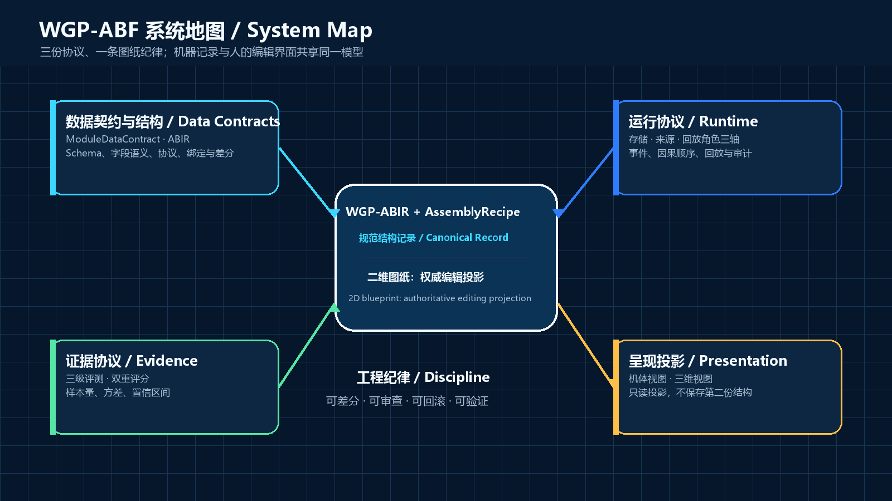
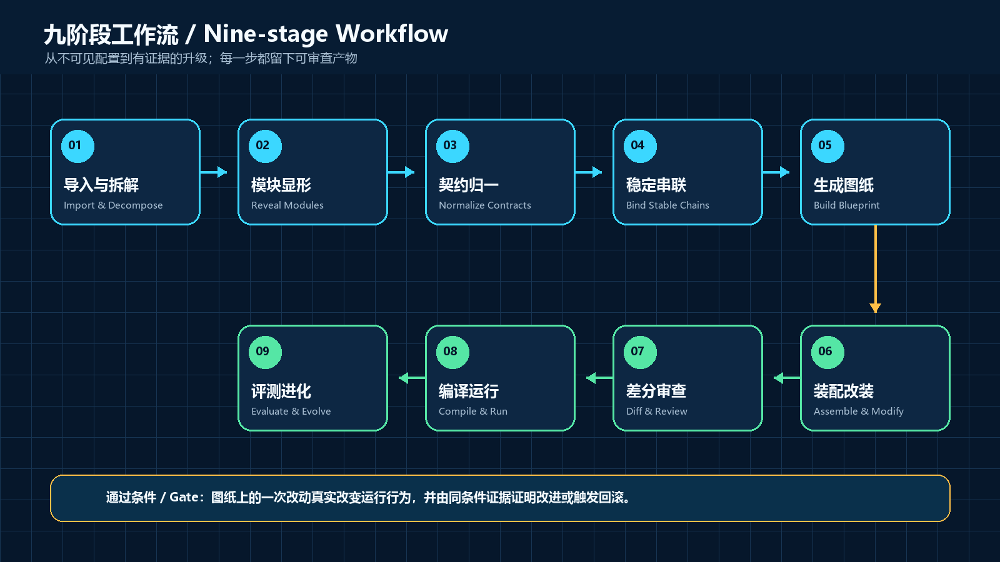
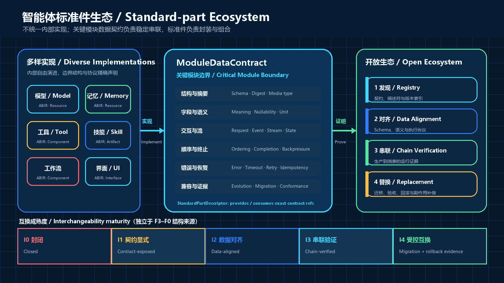

<!-- SPDX-License-Identifier: CC-BY-4.0 -->

# WGP 智能体机体化流程（WGP-ABF）

## 模块数据契约、智能体工程图纸与证据化演进框架

**版本 0.6 — 中英双语图解公开草案**

**概念提出者与主要作者：王广平（Wang Guangping）**

**发布日期：2026 年 8 月 27 日**

**状态：Public Draft；不是行业标准，也不是认证计划**


> WGP-ABF 让智能体配置成为可视、可差分、可测试、可改装、可验证的一等工程产物。

在 WGP-ABF 中，**机体化（Bodification）**是一个项目专用词：它指把智能体配置转化为有类型、有版本、可观测、可测试的工程装配体。它不表示物理具身、人格化或生物学建模。结构规范使用 `Component`、`Edge`、`Container` 和 `AssemblyRecipe`；“机体”只用于面向人的可选视觉投影。

> **核心命题：百花齐放解决创新，数据契约解决串联，标准件解决复用。WGP-ABF 不统一模块内部实现；它首先对齐关键模块边界的数据结构与交换协议，再用可执行证据证明这些边界能够稳定运行。**

---

## 摘要

现代智能体由模型、工具、记忆、沙箱、权限、审批、子智能体、运行时和外部服务共同组成。生成式编程正在降低单个模块的实现成本，但智能体是否可靠，越来越取决于模块之间能否持续交换正确的数据。长期需要维护的工程资产已经从源代码延伸到模块数据契约、装配配方、评测集、证据、标准件包和治理策略。智能体生态却普遍缺少对边界数据、交换语义、语义差分、评审、测试、归因、互换和回退的共同工程表示。

WGP-ABF 提出一种平台中立的智能体配置工程方法，把配置转换为可拆解、可编辑、可运行、可评测和可诊断的工程产物。它采用无环、单向的精确引用：独立 SchemaBundle 保存不可变数据结构闭包；`ModuleDataContract` exact-reference 它并唯一定义关键边界的字段与交换语义；关键 ABIR Port 和 `StandardPartDescriptor` 指向 Contract channel／role；Profile 与 Suite 固定目标和测试要求；定向兼容评估比较 exact Contract 且不固定目标 Recipe；采用 `exact | compatible | adapter` resolution 的 `AssemblyRecipe` 固定实际装配；运行事件与报告再 exact-reference 被执行的 Recipe 与生产者→消费者链；整件互换和替换结论最后消费这些证据。后置对象不得反向成为前置对象的事实来源。可执行一致性测试、分层评测、统计条件和诊断报告分别约束“能够连接”“能够稳定串联”和“能够改善任务结果”三类不同主张。二维工程图纸是这些事实面向人的权威编辑投影；机体和三维视图仅是可选的只读解释投影。

v0.6 把**关键模块边界的数据结构与交换协议**确立为标准化智能体配件的第一性对象。数据契约同时约束载荷 Schema、方向、基数和版本协商，以及顺序、流式分帧与结束、状态关联、错误分类、超时与取消、重试、幂等和重复数据处理。仅能解析同一种 JSON 或通过同一个 Schema，不等于两端行为等价，更不等于它们能在长时间运行、失败恢复和并发条件下稳定串联。数据结构对齐提供自由装配的必要条件；执行语义对齐与可执行证据提供稳定串联的保障。

标准件是对数据契约的**实现与打包**，不是契约本身。实现者继续自由选择模型、算法、语言、框架和内部架构；Descriptor 通过 `assembly.surfaces[].contractRef` 和本地 `bindings[]` 把实现表面映射到 Contract 的 `channelId + contractRoleId`，`AssemblyRecipe.contractBindings[]` 再把具体生产者与消费者表面绑定到各自的 exact 契约通道，随后由包、兼容性档案、一致性报告、互换评估和替换计划完成供应链、验证与运维责任。标准件仍可映射 ABIR 的六类真实对象，市场与替换仍有价值，但它们位于数据契约层之上。I0–I4 继续表示定向、有时效的互换证据，并与 F3–F0 来源等级、C0–C3 实现合规等级和字段级操作能力相互正交。

WGP-ABF 的核心价值不是减少配置输入，而是提升理解、串联、组合和归因能力：揭示一份配置实际装配了什么，检查每条关键数据链使用哪份契约及其版本，验证结构与执行语义，从开放注册表发现实现同一契约的候选标准件，把一次替换形成 `ReplacementPlan` 与可审查的 `RecipeDiff`，并在相同任务集与受控环境下验证改动是否带来改善。任何合规实现都必须标注结构来源，并把数据契约、操作能力与互换证据分别声明；C1 必须提供可验证图纸，C2 写回声明还必须证明图纸修改能够改变实际运行，C3 证据声明还必须区分事件的三个维度并让每个分数可追溯到原始证据。DeepSeek Harness（DSH）是首个版本化参考适配案例，但不是该方法的概念边界。



**图 1 — 系统地图。** WGP-ABIR 与 `AssemblyRecipe` 是规范、可版本化的结构记录；`ModuleDataContract` 固定模块边界的数据结构和交换语义；标准件实现并打包这些契约；二维图纸是同一工程记录面向人的权威编辑投影。所有视图和市场条目必须引用同一模型，不得暗中维护第二份业务结构。

---

## 1. 愿景、目标用户与非目标

### 1.1 愿景

让普通用户能像查看装配图一样理解智能体，让开发者能像评审 API 一样评审模块边界，让契约作者定义稳定的数据链，让标准件作者在保留内部创新自由的同时实现这些契约，让团队能像做受控实验一样验证每次连接与替换。

WGP-ABF 希望建立一条连续工作流：

1. 从真实平台导入配置并说明每项信息来自哪里；
2. 用二维工程图纸呈现组件、接口、关系、权限、容器和关键数据链；
3. 为每条关键数据链绑定固定版本的数据契约，检查数据结构与交换语义；
4. 通过标准描述符与注册表发现实现相同契约的候选标准件，而不要求其内部实现相同；
5. 计算目标环境中的互换等级并生成 `ReplacementPlan`；
6. 把修改表达为可读、可审查、可应用的 `RecipeDiff`；
7. 编译到目标平台，执行契约与生命周期一致性套件并检测漂移；
8. 在可重复条件下采集运行证据，形成有边界的结论，升级、保留实验或回退。

### 1.2 目标用户

- 想看懂、修改或组合智能体的普通用户；
- 构建 Agent Studio、运维平台和可视化编辑器的产品团队；
- 发布数据契约、标准件、适配器、测试套件或注册表的开源作者与厂商；
- 需要审计权限、供应链、插件与数据流的安全和治理人员；
- 研究智能体评测、诊断和组件交互的工程师；
- 希望建立开放标准件市场而不锁定内部技术路线的社区。

### 1.3 非目标

WGP-ABF 不要求所有平台采用同一种运行时，也不统一标准件内部算法、语言或框架。它只标准化参与互操作的边界语义；平台无法满足某项语义时，必须明确拒绝、适配或声明语义损失。WGP-ABF 也不把人形外观当作结构真相，不以隐藏架构替代安全控制，不声称一次 A/B 就能完成因果归因，不把数据格式兼容写成行为等价，也不把任何单一模型、注册表或厂商定义为唯一实现。标准件不表示所有实现趋同；它表示一个实现对固定数据契约承担了可验证责任。

---

## 2. 问题边界与设计原则

### 2.1 需要解决的八个问题

1. **不可见**：用户只能看到 YAML、JSON 或表单，看不到完整装配体。
2. **不可串联**：模块即使都能处理 JSON，也可能在字段语义、顺序、流、状态、错误、超时、重试或幂等性上不一致。
3. **不可审查**：文本 diff 无法稳定表达“换了哪个组件、影响哪条路径”。
4. **不可回写**：很多可视化只读，修改不能安全落回真实运行配置。
5. **不可验证**：格式校验常被误当作行为兼容，缺少覆盖正常流、失败流、恢复流和重复投递的可执行契约向量。
6. **不可归因**：分数存在，但分数、原始证据与结构对象之间没有引用链。
7. **不可治理**：插件来源、权限、审批、补偿和版本漂移缺少统一记录。
8. **不可流通**：契约、实现和包身份混在一起，优秀模块缺少可移植数据契约、内容寻址包、兼容性档案、可执行一致性测试和可信注册记录。

### 2.2 八条设计原则

- **真实优先**：每条结构 claim 都必须说明来源和覆盖度。
- **一个模型，多种投影**：机器规范记录、二维编辑图纸和三维展示不复制业务事实。
- **权限与来源分离**：F3–F0 不自动授予查看、编辑、编译或回写能力。
- **契约先于标准件**：先固定关键模块边界的数据结构与交换协议，再描述实现、包、市场和替换。
- **格式与行为分离**：Schema 兼容只证明数据结构条件，顺序、流、状态、错误、超时、重试和幂等需要独立验证。
- **声明与状态分离**：配方描述期望配置；运行事件描述实际过程。
- **证据先于升级**：修改只有通过预先声明的门槛，才能进入稳定版本。
- **渐进式复杂度**：新手先完成安全的目标，专家再展开字段、互换等级、统计和治理细节。

### 2.3 模块数据契约贯穿九阶段流程

模块数据契约不是标准件市场的附属元数据，而是图 2 九阶段中贯穿导入、编译、运行和证据的可验证对象：

1. **导入**：收集 ABIR、`SourceClaim`、已有契约引用与标准件包身份；
2. **模块显形**：识别关键数据边界、可替换对象和仍需封装的内部子图；
3. **契约显形**：生成或读取 `ModuleDataContract`，固定结构、交换语义、状态和失败处理；
4. **关系显形**：通过 `contractBindings` 在 exact Contract 下解析生产者与消费者实现表面、检查适配需求，并显式保留独立的 surface→ABIR port 映射；
5. **图纸生成**：在同一 ABIR 上显示关键数据链、契约状态、当前件、候选件与 I0–I4 证据范围；
6. **装配改装**：查询实现同一契约的候选标准件，选择 `CompatibilityProfile`，重新计算 Assessment 并生成 `ReplacementPlan`；
7. **差分审查**：把契约或实现变更编译为 `RecipeDiff`，展示语义变化、权限、状态迁移、风险与补偿；
8. **编译运行**：解析固定摘要的契约与包，执行 `ConformanceSuite`、产生 `ConformanceReport`，核验数据链和生命周期计划；
9. **评测诊断**：在真实任务集上复测，发布有范围和有效期的证据，或执行回退。



**图 2 — 九阶段工作流。** 每一阶段都留下可审查产物；最后的门槛不是“Schema 校验通过”“标准件能安装”或“成功启动”，而是关键数据链在声明的正常、失败和恢复路径中按契约运行，并且修改得到同条件证据支持，或在不满足门槛时触发回退。

---

## 3. 规范语言、版本与合规档位

本文中的“必须／不得／应／应当／不应／不应当／可以”分别对应 RFC 风格的 `MUST / MUST NOT / SHOULD / SHOULD NOT / MAY`；其中“应”与“应当”、“不应”与“不应当”具有相同规范力度。只有显式使用这些词的句子构成规范性要求，其余内容用于解释和指导。

### 3.1 版本

- `format`：文档所属的格式兼容族，例如 `wgp-abir/0.6`；
- `version`：某份 ABIR 或 AssemblyRecipe 对象的发布版本；
- `specificationVersion`：`ModuleDataContract` 采用的 WGP-ABF 机器规范版本；
- `identity.version`：ModuleDataContract 或 StandardPartDescriptor 所标识契约／实现的发布版本；
- `descriptorVersion`：标准件描述符所采用的描述格式版本；
- `adapter.version` 与 `adapter.implementationDigest`：`SourceClaim` 中的平台适配器版本及实现摘要。JSON Schema 方言由 `$schema` 固定，发布位置和不可变规范版本由带标签的 `$id` 固定，不另造 `schemaVersion` 字段。

本白皮书的 **0.6** 是面向读者的版本系列简称；包、验证器和机器规范发布使用 SemVer **0.6.0**。`wgp-abir/0.6`、`wgp-module-data-contract/0.6`、`wgp-standard-part-descriptor/0.6`、`wgp-recipe-diff/0.6`、`wgp-runtime-event/0.6` 一类 `format` 值表示 **0.6 格式兼容族**，不是包版本；同一兼容族的补丁发布必须继续接受已有合法文档，只有破坏兼容性时才能进入新的格式族。不可变 Git 标签 **`v0.6.0`** 固定该次发布的 Schema、样例和构建产物，Schema `$id` 必须引用这一标签，而不得引用可移动分支。

`0.y.z` 表示公开草案。破坏性字段或语义修改必须提高次版本，补丁版不得改变既有合法文档的含义。白皮书 0.6、包／规范版本 0.6.0、格式兼容族 `/0.6` 与 Git 标签 `v0.6.0` 指向同一首发语义基线，但分别服务于文档标识、工具分发、文档兼容判断和不可变发布定位，不得互相替代。

### 3.2 分级核心合规与可选投影合规

| 等级 | 名称 | 最低要求 |
|---|---|---|
| C0 | 可视化说明器 | 明确标注为非合规的教学或展示原型，不得声称运行保真度 |
| C1 | 图纸合规 | 合法 ABIR + AssemblyRecipe、关键边界的 ModuleDataContract 与 contract bindings、强类型边、逐对象来源、唯一规范记录、可导出表示 |
| C2 | 操作合规 | C1 + 契约执行语义校验、字段级能力、语义差分、风险审查、原生编译、运行绑定核验和回退纪律 |
| C3 | 证据合规 | C2 + 正常／失败／恢复路径的一致性证据、事件三轴、安全回放、评测不确定性、claim 成熟度、对象诊断和可比复测 |

实现必须公开验证器版本、支持的 Schema 与适配器版本、例外和其合规声明的证据。精美的机体、标准件市场或三维视图不会提高核心合规等级。

**Projection Conformance** 是独立的可选标签。实现如提供二维、机体或三维投影，则必须证明投影由规范记录生成，编辑只发生在声明为可回写的二维字段上，并提供键盘操作、文字替代和非颜色编码。没有机体或三维投影不影响 C1–C3。

标准件的 I0–I4 互换结论不等于实现的 C0–C3 合规等级，也不等于 F3–F0 来源等级。I 描述一对固定实现的定向替换证据，C 描述一套 WGP-ABF 实现覆盖的规范责任，F 描述结构字段来自哪里。三个轴必须分别记录，任何一个都不得从另外两个推导。

---

## 4. 规范模型：结构、数据契约、实现、证据与投影

WGP-ABF 的唯一规范结构事实由 **WGP Agent Blueprint Intermediate Representation（WGP-ABIR）** 与 **`AssemblyRecipe`** 共同构成：

- **WGP-ABIR** 表达对象、端口、关系、来源 claim 和可用能力；
- **AssemblyRecipe** 表达可编译的期望配置、版本锚点与目标平台；
- **ModuleDataContract** 表达可复用、可内容寻址的边界数据结构与交换语义；
- **Evidence Store** 保存事件、任务结果、产物引用、互换验证和评测结果；
- **ProjectionProfile** 保存布局、主题、机体映射和无障碍说明。

契约、结构、实现和装配必须遵守下表的唯一事实所有权：

| 对象 | 唯一拥有的事实 | 只能引用、不得复制的事实 |
|---|---|---|
| `ModuleDataContract` | exact `schemaBundleRef`、字段语义、协议、流、顺序、错误、超时、重试、幂等与状态 | SchemaBundle 是独立不可变对象；独立 Suite 指向 exact Contract，Contract 不得反向引用 Suite，也不拥有 ABIR 位置、实现包或配方选择 |
| ABIR `Port` | 对象中的结构位置、端口身份、结构方向／必选性；关键契约链上的单向端口带 `contractChannel {contractRef, channelId, roleId}` | 不再声明第二份 Schema、协议或运行语义；契约范围外的端口可以省略 `contractChannel`，需契约化的双向交互拆成两个有向端口 |
| `StandardPartDescriptor` | exact 实现身份；`assembly.surfaces[].contractRef`；本地 `bindingId → channelId + contractRoleId` 实现映射；包入口 | 不拥有契约语义，不拥有或复制实例 ABIR port 映射 |
| `AssemblyRecipe` | 根 `contractBindings[]` 解析生产／消费链；`surfaceMappings[].portMappings[]` 解析 `assemblyBindingId → abirPortId` | 不重新定义契约，不成为实现描述符 |
| `ConformanceReport` / Assessment | 对已解析 Binding 的执行证据和有时效结论 | 不回写或修改契约、端口、描述符或配方 |

规范发布采用从前置事实到后置对象的单向 DAG：`SchemaBundle / ModuleDataContract / Port / Descriptor / Package / Profile / Suite / Environment → contractCompatibilityAssessment → AssemblyRecipe → RuntimeEvent → ConformanceReport → ReplacementPlan / InterchangeabilityAssessment / RecipeDiff`。这里 `A → B` 表示 B 可以引用已冻结的 A，绝不表示 A 可以反向引用 B；每个分支对象只引用其 Schema 要求的前置对象。兼容评估固定 exact Contract channels／roles，但不固定目标 Recipe；Recipe 可以在 `contractBindings[].resolution` 中引用可采信的评估或适配器；运行事件与报告随后固定该 exact Recipe 及其已解析的生产者→消费者链。反向发现必须使用索引，不得创造哈希环或第二份事实。

每个 `schemaContentHash` 都是完整 Schema 文档经 RFC 8785 规范化 UTF-8 JSON 序列化后的 SHA-256，不是源文件字节摘要；空白与对象成员顺序不得产生不同的 Schema 身份。

标准件对象不建立第二份结构或契约事实。`StandardPartDescriptor` 以 `partKind` 映射 ABIR 六类对象之一，并用 `assembly.surfaces[].contractRef` 与本地 `bindings[]` 记录实现映射；`StandardPartPackage` 绑定内容寻址的实现产物；`CompatibilityProfile.requiredContractChannels` 定义目标必需通道；`InterchangeabilityAssessment` 记录一次定向、有时效的成对替换结论；`ConformanceSuite.contractRefs` 和链路级 `ConformanceReport` 分别表示“如何验”和“生产者到消费者实际验到了什么”；`ReplacementPlan` 表示“如何换”；`PartRegistry` 只索引带不可变摘要的版本化对象。

`AssemblyRecipe.contractBindings[]` 的每项包含 `contractBindingId`、`producer/consumer {standardPartBindingId, surfaceId, assemblyBindingId}` 与 `resolution {mode, ...}`，其中 `mode` 为 `exact | compatible | adapter`；生产端与消费端各自的 Contract 和 `channelId` 必须分别由该方 surface 的 `contractRef`／本地 binding 唯一解析，Recipe 不重复存储任一方的 Contract 或 channel。`standardPartBindings[].surfaceMappings[].portMappings[]` 另将 `assemblyBindingId` 映射到实例 `abirPortId`。前者固化契约链责任，后者固化实现表面到结构实例的位置；任何 Binding 都不得重复维护 Schema、协议或状态事实。

`ProjectionProfile` 不得成为 `Component` 的必填字段。`arm.browser` 一类视觉名称不得进入核心类型系统。布局变化、市场排序和推荐结果不得造成配方语义变化。

### 4.1 核心对象类别

| 类别 | 用途 | 示例 |
|---|---|---|
| `Component` | 可替换、可配置、可独立观测的运行单元 | 模型提供器、记忆检索器、工具执行器 |
| `Resource` | 被组件读取或写入的数据与能力资源 | 向量库、文件系统、模型凭据引用 |
| `Policy` | 在模型外强制执行的约束 | 网络策略、审批规则、预算上限 |
| `Artifact` | 可寻址的运行、标准件包或评测产物 | 包、补丁、报告、截图、日志片段 |
| `Interface` | 智能体系统对外暴露的 HTTP、CLI、RPC 或 UI 表面 | 外部 REST API、命令行入口、管理 UI |
| `Container` | 对对象进行唯一包含的层级 | 子智能体模块、工具组 |

消息、提示词、任务定义和策略不应为了画图或上架方便而全部伪装成 `Component`。

### 4.2 规范化与身份

符合规范的实现必须为对象提供稳定、带命名空间的 ID。用于哈希、签名和缓存的 JSON 应使用确定性规范化；推荐 RFC 8785 JSON Canonicalization Scheme。包含关系必须只有一个权威表示，不得同时由 `Container.contains` 和重复 containment edge 维护。

跨配方、描述符、标准件包和注册表引用必须同时固定版本与内容摘要。无法解析、摘要不匹配、出现循环但未声明递归模块、或 ID 冲突时，导入必须失败并给出可定位诊断。注册表显示名和下载量不得替代内容身份。

带根 `contentHash` 或 `recordHash` 的 JSON 文档必须使用无递归自摘要规则：先移除待计算的根摘要字段，再按 RFC 8785 规范化剩余文档，最后对规范化 UTF-8 字节执行 SHA-256。exact ref 使用该结果；不得对占位值求摘要，也不得把字段自身递归纳入输入。

---

## 5. 结构来源：保真度不是权限或互换等级

F3–F0 作为清晰的界面徽标继续保留，但 `structuralProvenance` 只表示某条 claim 的结构来源，不表示信任结论，不授予任何操作权限，也不表示标准件可互换：

- **F3 Native（原生）**：来自目标平台原生、可定位的权威结构表示；
- **F2 Exported（导出）**：来自平台或版本化适配器的可重复结构导出；
- **F1 Inferred（推断）**：由静态分析、运行观测或其他证据推断；
- **F0 Manual（人工）**：由人工直接声明，尚未获得更高等级的结构来源证据。

除通用 claim 标识 `id` 外，每条 `SourceClaim` 必须包含：`subjectId`、`fieldScope`、`structuralProvenance`、`identityAssurance`、`fieldCoverage`、`runtimeEvidence`、`operationCapabilities`、`trustState`、`method` 与 `observedAt`。`fieldScope` 是该 claim 覆盖的 JSON Pointer 集合；身份稳定性、字段覆盖、运行证据和信任状态必须分别记录，不能由 F 等级代替。`adapter`、`evidenceRefs` 与 `expiresAt` 为可选字段；存在失效期限时，过期 claim 不得继续作为当前证据使用。


**图 3 — 来源与权限分离。** F3 Native（原生）不代表可编辑或可互换，F2 Exported（导出）也不代表“受限可编辑”。操作能力必须由适配器和字段级证明独立声明；I0–I4 则由第 12 章逐级要求的成对互换证据决定。

### 5.1 操作能力

`operationCapabilities` 是 `SourceClaim` 针对 `fieldScope` 所覆盖字段给出的可组合能力集合，可以同时包含：

- `view`：能够稳定显示；
- `edit`：允许生成合法修改；
- `compile`：能编译为目标平台配置；
- `roundTrip`：导出、修改、回写后能保持声明的语义；
- `hotReload`：在声明的运行阶段内无需整体重启；
- `replace`：支持原子替换并保留接口约束。

这些值说明适配器已证明的技术能力，不等同于当前用户授权、部署策略、审批结果或 I 级别；执行操作时仍必须同时满足这些约束。能力不得从 `structuralProvenance`、`trustState`、注册表排名或单一运行观测推导。整机界面应报告 claim 覆盖向量，例如 `F3 62% / F2 21% / F1 12% / F0 5%`，而不是用单个最低值掩盖差异。关键路径必须针对具体任务声明。

---

## 6. 模块数据契约、强类型图与稳定串联

结构边必须连接明确端口，而不是只连接两个框：

```text
sourceObject + sourcePort(contractChannel {contractRef, channelId, roleId})
  -> edge(type, policyRefs)
  -> targetObject + targetPort(contractChannel {contractRef, channelId, roleId})
```

ABIR Port 只拥有对象内的结构位置、端口身份和结构方向／必选性；关键契约链上的单向端口带 `contractChannel {contractRef, channelId, roleId}`，契约范围外的端口可以省略它，需要契约化的双向交互必须拆成两个有向端口。独立 SchemaBundle 拥有不可变 Schema 闭包；`ModuleDataContract` exact-reference 它，并唯一拥有字段语义、基数、协议、同步／流式方式、顺序、错误、重试与状态。编译器解析双方 Contract channel／role 后，必须拒绝角色冲突、契约不兼容和必需通道未连接；独立的 Profile、Recipe 与权限策略检查必须拒绝未经授权的权限扩张。即使两个通道的数据 Schema 兼容，运行时仍可能因为顺序、分帧、状态或失败处理不同而无法稳定串联。

推荐语义关系标签包括：

- `data.flow`：消息或结构化数据流；
- `control.invoke`：调用与控制关系；
- `capability.consume`：组件消费某项能力；
- `policy.enforce`：策略强制作用于对象或边；
- `artifact.produce`：组件产生可寻址产物；
- `evidence.support`：证据支持一条 claim 或评分。

这些 profile 级标签必须显式映射到 ABIR Schema 允许的核心 `edgeKind`，不能隐式扩展枚举。`errorPropagation` 由 `ModuleDataContract` 唯一拥有，不得与静态结构边混为同一事实；运行或诊断投影只能引用契约定义，并由运行事件证明实际结果。

### 6.1 第一性对象：`ModuleDataContract`

`ModuleDataContract` 是一个独立、版本化、内容寻址的模块边界协议。它不描述模块怎样实现功能，而是描述另一模块为了正确消费其输出必须依赖的事实。只有跨关键模块边界、会影响任务正确性、状态一致性或恢复能力的数据链才必须提升为独立契约；模块内部的普通函数调用不必全部公开。资源限制、授权上下文、敏感字段策略和租户隔离仍属于策略／Profile 关注点和未来 Contract 扩展，不是 v0.6 核心 Contract 字段。

一份可执行的数据契约至少覆盖下列维度：

| 维度 | 需固定的事实 | 代表性失败 |
|---|---|---|
| 数据结构 | 输入／输出 Schema、字段语义、必选性、空值、编码、基数、版本协商 | 字段同名异义、缺省值不一致、旧版本被静默误读 |
| 顺序 | 有序范围、序号、相关 ID、乱序与迟到处理 | 工具结果先于调用、状态提交先于校验 |
| 流 | 分帧、开始／结束标记、背压、部分结果、取消后的尾帧 | 流被当成单包、结束信号丢失、消费者积压失控 |
| 状态 | 会话与事务关联、checkpoint、提交点、迁移、并发可见性 | 请求串线、恢复到错误状态、重复提交 |
| 错误 | 稳定错误类别、可重试性、部分成功、传播与降级 | 永久错误被无限重试、部分成功被当成全失败 |
| 时间 | timeout 时长、起算点、超时动作与取消行为 | 生产端与消费端从不同位置开始计时，或对超时动作的解释不一致 |
| 重试与幂等 | attempt 身份、幂等键、退避、去重窗口、重放规则 | 重复扣费、重复发信、重复写入记忆 |
| 未来时间／资源／安全扩展——不属于 v0.6 核心 Contract 合规 | deadline 传播、迟到结果／副作用策略、租约／过期、链级超时预算、重试放大、大小／速率限制、授权上下文、敏感字段、租户隔离 | 工作失控、超限崩溃、授权上下文丢失、跨租户泄漏 |

v0.6 使用 `ModuleDataContract` 作为该机器对象名称。Descriptor 的 `assembly.surfaces[].contractRef` 固定契约，surface `bindings[]` 以本地 `bindingId` 映射 Contract `channelId + contractRoleId`；Recipe 根 `contractBindings[]` 解析生产者→消费者链。契约引用必须固定 `contractId`、版本和内容摘要。契约的 breaking change 必须产生新版本，不得只修改注册表中的可移动内容。字段名称服务于机器互操作；自然语言标题、市场分类或 UI 标签不能替代它们。

### 6.2 契约、端口、标准件与配方的职责

四类对象分工如下：

1. 独立 SchemaBundle 定义不可变数据结构闭包；`ModuleDataContract` exact-reference 它并唯一定义交换语义与通道角色；
2. ABIR Port 只定位局部连接点；关键契约链上的单向端口以 `contractChannel {contractRef, channelId, roleId}` exact-reference 一个契约通道角色，契约范围外的端口可以省略它，需要契约化的双向交互使用两个有向端口；
3. Descriptor 的 `assembly.surfaces[].contractRef` 和本地 `bindings[]` 只把具体实现表面映射到 exact Contract channel／role，不映射 ABIR port；
4. Recipe 的 `contractBindings[]` 只解析生产端与消费端实现表面，`surfaceMappings[].portMappings[]` 再把 `assemblyBindingId` 映射到实例 `abirPortId`。

同一契约可以被多个内部实现不同的标准件实现；同一标准件也可以实现多个契约。若生产端和消费端使用不同契约版本，适配器必须作为带版本与内容摘要的显式实现进入 Binding，并公开其语义损失；不得在编译器内部进行不可见字段改写。逐边兼容也不自动推出整条链端到端兼容，链级状态、背压和副作用必须另外验证；链级超时预算与重试放大在 v0.6 中仍属于未来 Profile 扩展。

因此，**标准装配面**是数据契约与运行要求在一个具体标准件上的实现表面；标准件是该表面的实现与可部署打包。它们是数据契约的上层应用，而不是第一性标准。标准化这些边界不限制内部算法、框架、模型或许可证。只有跨边界可检查的信息进入契约和描述符，私有实现细节保持私有。

### 6.3 从结构对齐到可执行证据

“Schema 校验通过”只能证明某个样本满足数据格式，不能证明生产者在所有分支都按契约发出数据，也不能证明消费者对顺序、流、状态和错误的解释相同。契约一致性套件必须同时包含合法向量、边界向量、非法向量以及失败和恢复序列，并至少验证：

- Schema 与版本协商；
- 有序、乱序、重复和迟到消息；
- 流开始、增量、结束、取消与背压；
- checkpoint、恢复、迁移和并发状态；
- 可重试／不可重试错误、部分成功和降级；
- timeout 时长、起算点、超时动作与取消行为；
- 重试退避、幂等键、去重窗口与重放。

未来时间／资源／安全 Profile 可以增加 deadline 传播、迟到结果或副作用策略、租约与过期、链级超时预算、重试放大、授权上下文、大小或速率限制、敏感字段策略和租户隔离。这些关注点没有建模为 v0.6 核心 Contract 字段，不得作为 v0.6 核心 Contract 或 Suite 合规门槛。

`ConformanceSuite` 定义这些向量。链路级 `ConformanceReport` 必须 exact-reference 它实际执行的 Recipe，并绑定 resolved `contractBinding`、双方 exact Contract 与实现、必要适配器、Profile、Suite、执行器、环境、结果和支撑 RuntimeEvent；只测试单边实现的报告不能证明稳定串联。报告只能证明这对生产者→消费者在其覆盖条件下遵守契约，不能证明两个实现行为等价、任务质量相同或所有环境都可靠。稳定串联主张必须给出覆盖范围、失败向量、环境、时间窗和仍未验证的语义；行为等价或任务改进必须使用第 10 章的独立评测证据。


**图 4 — 数据契约链。** ABIR 端口定义连接点，`ModuleDataContract` 对齐边界数据与交换语义，`contractBindings` 把 exact 契约落实到数据链，标准件实现契约，一致性套件与报告验证正常、失败和恢复路径。市场发现与替换位于这条可信链之上。

可复用子图由 `ModuleDefinition` 表达。模块实例必须显式声明暴露端口、参数、内部版本与状态隔离方式。递归模块必须有深度、资源和终止约束。

---

## 7. RecipeDiff、ReplacementPlan、审批、事务与漂移

一次修改必须首先成为 `ReplacementPlan` 或其他可审查提案，再编译为 `RecipeDiff`；它不得直接覆盖文件或执行注册表推荐。`ReplacementPlan` 描述替换双方、要求的 I 级别、配置转换、状态迁移、权限差分、执行步骤、验证向量、回退、审批和证据引用。只有计划中的前置条件与证据仍然有效时，才能生成可应用差分。

数据契约变化必须作为一等语义差分显示。修改 Descriptor `assembly.surfaces[].contractRef`／`bindings[]`、Recipe `contractBindings[]` 或 `surfaceMappings[].portMappings[]` 时，差分必须指出受影响的数据链、旧／新契约 exact ref、结构变化、交换语义变化、所需适配器以及必须重跑的套件。即使新旧 Schema 互相接受，只要顺序、流、状态、错误、超时、重试或幂等规则发生变化，就属于潜在破坏性变更。契约版本或 Binding 变化会使依赖旧契约的报告与 Assessment 失效，除非新的可执行证据明确覆盖迁移后的链路。

除格式、身份、创建时间和配方身份外，`RecipeDiff` 的核心字段是：

- `baseVersion` 与 `baseContentHash`：锁定修改前的配方版本和规范化内容摘要；
- `targetVersion` 与 `targetContentHash`：锁定预期修改后的版本和内容摘要；
- `preconditions`：声明事务级版本、摘要、路径存在性或路径值前置条件；
- `operations`：有序原子操作；每个操作包含自己的 `precondition`、`restartRequired`，并以 `operations[].compensation` 记录可执行的配置逆操作；
- `riskAssessments`：按受影响路径记录风险类别、严重度、缓解措施、残余风险和风险审批；
- `compensation`：记录事务恢复策略，以及 `externalSideEffects` 中每项外部副作用的补偿动作、验证、幂等性和责任人；
- `approval`：记录整个事务是否需要审批及其状态；它不能替代 `riskAssessments[].approval` 对具体风险的审批。

操作的配置逆操作、配置回滚、外部副作用补偿和真正不可逆操作是四个不同概念。`operations[].compensation` 只描述单个操作对 `AssemblyRecipe` 的逆操作；配置回滚按安全顺序执行这些逆操作并验证目标摘要；顶层 `compensation.externalSideEffects` 处理配方文档之外已经发生的效果；没有真实逆操作或可靠补偿的动作属于不可逆操作，不得用空操作伪装成可恢复。

编译器必须确定、幂等，并在应用前验证前置版本、标准件包摘要与配方摘要。原子应用要么全部成功，要么保持原状；不支持原子的目标平台必须显式报告部分失败语义和恢复点。应用前后的导入结果应执行语义漂移检测。

不可逆操作必须默认拒绝。当前核心 Schema 不能把没有真实补偿的动作声明为“安全可恢复”；部署扩展只有在策略明确允许、`riskAssessments` 单独展示风险、获得独立审批并留下审计记录时才可以执行，而且必须明确说明无法回滚的外部结果。

---

## 8. 运行事件、因果顺序与三类回放

`RuntimeEvent` 的信封至少包含：

```json
{
  "format": "wgp-runtime-event/0.6",
  "eventId": "44444444-4444-4444-8444-444444444444",
  "runId": "run.example-01",
  "sessionId": "session.example-01",
  "sequence": 12,
  "eventType": "tool.completed",
  "occurredAt": "2026-08-27T08:00:00Z",
  "observedAt": "2026-08-27T08:00:00.042Z",
  "producer": {"name": "adapter.dsh", "version": "0.6.0", "instanceId": "runtime.local-01"},
  "subject": {"abirId": "agent.example", "objectId": "component.tool.browser", "recipeId": "recipe.example"},
  "trace": {"traceId": "0123456789abcdef0123456789abcdef", "spanId": "0123456789abcdef"},
  "storageClass": "durable",
  "origin": "primary",
  "replayRole": "expectedOutcome",
  "payload": {},
  "redaction": {"state": "none", "removedFields": []}
}
```

事件的三个维度必须分开：

| 维度 | 取值 | 含义 |
|---|---|---|
| `storageClass` | `durable / ephemeral` | 是否进入持久记录，或仅在实时会话中存在 |
| `origin` | `primary / derived` | 是原始观测，还是由其他事件确定性派生 |
| `replayRole` | `input / expectedOutcome / verificationOnly / projectionOnly / excluded` | 在声明的回放中作为输入、预期结果、验证、界面投影或被排除 |

派生事件也可以持久化；ephemeral 事件也可能是原始观测。`tool.started` 若记录真实开始时间，就是 primary event，不能仅因它可被界面推断而标成 derived。标准件替换、迁移、验证与回退必须产生引用 `ReplacementPlan`、描述符版本和包摘要的事件，以便重建实际使用的标准件身份。

关键数据链上的 `RuntimeEvent.contractExchange` 根必须记录生效的 `contractBindingId`、message、correlation、attempt、`resolution` 与 outcome，并只在契约要求时记录 causation、idempotency、ordering 和 stream 身份。`producer` 与 `consumer` 两侧必须分别固定 part/package、exact `contractRef`、`channelId`、`roleId`、`structureId`、payload Schema/Bundle、payload artifact 和准确序列化字节摘要，因此适配器前后的两份数据不会被折叠成一个假身份。错误、取消、超时、重试、去重和部分成功是契约执行事实，不得只留在非结构化日志中。事件序列能够证明“一次运行发生了什么”，但只有对照 Suite `testVectors[].aspects` 与 `applicableContractChannels` 并覆盖反例与恢复路径时，才能支持“该实现链路遵守契约”的结论。

实现必须明确区分：

1. **View Replay（视图回放）**：只使用已记录事实重建界面；
2. **Simulation Replay（模拟回放）**：使用固定依赖或录制的模型流验证接口与路径；
3. **Re-execution（重新执行）**：重新调用真实组件，结果可能变化并产生新事件链。

事实性回放输入来自 `durable + primary` 事件或其受控加密引用；derived 层必须可由声明的确定性函数重算，并在形成派生事件时使用 `derivation.sourceEventIds`。事件处理还必须定义重复投递、乱序、迟到、时钟漂移、写盘失败和副作用执行前 checkpoint 的策略。

隐私要求优先于“保存所有明文”。系统可以保存输入清单、摘要和受访问控制的加密引用，但必须说明保留期、删除、密钥和租户隔离语义。

---

## 9. 可观测性与开放映射

WGP-ABF 不替代 OpenTelemetry。实现应当把 `traceId / spanId` 与 OpenTelemetry trace 对齐，把 WGP 对象 ID、配方摘要、契约 ID／版本／摘要、contract binding、标准件包摘要、替换计划和 evidence 引用作为语义属性。GenAI 语义约定仍在演进，适配器必须固定所采用的版本或 commit，不得只写“使用最新版本”。

遥测采集必须遵守：

- 原始事件命名空间与平台原生事件命名空间分离；
- 转换规则公开、版本化并能说明语义损失；
- 高敏字段默认脱敏，秘密值不得进入普通日志；
- 事件到结构对象或标准件身份是一对多或多对一时，必须保留明确引用，不能伪造一一对应；
- 评分、互换证据和诊断只引用稳定 evidence ID，不复制易漂移的日志文本。

---

## 10. 评测设计、统计协议与贡献边界

WGP-ABF 同时记录两个正交维度：**评测单位**和**证据设计**。

### 10.1 评测单位

- `eval.component`：验证单个组件的接口、局部质量、成本与安全；
- `eval.assembly`：验证一个模块或子图中的交互；
- `eval.agent`：验证完整智能体的任务结果和用户体验。

每个标准件可以同时拥有“独立性能分”和“当前装配贡献分”。两者不可互换。格式兼容、契约对齐、链路验证、行为等价和任务质量是不同结论：Schema 接受只证明样本结构；I2 证明声明范围内的数据与交换语义可对齐；I3 证明固定生产者→消费者链路通过声明向量；任务质量仍由独立 `EvaluationRun` 判断。I1–I3 均不代表结果质量更高，I4 证明限定范围内的迁移、验收与回退证据闭合，也不自动证明任务表现改善或两个实现普遍行为等价。

### 10.2 证据设计

1. **Contract regression**：固定模型流或依赖，验证接口、事件和运行路径；
2. **Paired behavioral evaluation**：在相同任务和环境下配对真实采样，估计行为差异；
3. **Factorial or interaction evaluation**：存在多组件交互时使用因子设计，或明确不做单件贡献归因；
4. **Observational diagnosis**：用于发现相关性和提出假设，不得写成已验证根因。

`ConformanceSuite` 属于数据契约、链路与生命周期证据；`EvaluationRun` 属于行为比较和任务结果证据。固定模型流能降低模型输出变化，但不能让整个系统方差“接近零”，也不能单独证明某标准件对最终质量的因果贡献。若修改改变了上下文、工具结果、契约版本或调用 ID，旧流甚至可能不再有效。

### 10.3 最低统计记录

每份可比较 Scorecard 必须记录指标定义、样本独立单位、任务集版本、配对方式、重复次数、效应量、方差估计、置信区间算法、显著性水平、预设功效、最小可检测效应（MDE）、异常与缺失规则、停止规则、评价器版本和人工标注一致性。

安全、隐私和授权指标是不可由综合质量分抵消的门禁。跨平台行为分数可以比较，但标准件级归因必须同时展示双方 claim 覆盖、互换档案和证据强度。

---

## 11. 诊断假设、干预验证与改进决策

诊断报告不得直接把相关现象命名为 `rootCause`。它应使用：

- `suspectedCause`：由证据支持但尚未干预；
- `testedCause`：已执行预注册的干预；
- `validatedCause`：效应通过门槛且替代解释受到控制；
- `rejectedCause`：干预不支持原假设。

每条诊断必须引用 `partId`、`componentId`、`edgeId` 或子图、症状事件、对照证据和不确定性。诊断可以查询 `PartRegistry` 提出候选件，但推荐排序不得被写成根因或升级结论。一次改动的决策只有四类：`promote`、`hold`、`reject`、`rollBack`。不得把“未发现显著下降”自动写成“已经改善”。


**图 5 — 证据化改进闭环。** “进化”在本文中指由人或治理策略控制的可复现改进流程。诊断先定位数据契约、具体实现或装配关系，再产生 `ReplacementPlan`；计划经契约、差分、链路验证和真实任务评测后，才能升级或回退。系统不得未经授权自主改写自身。

---

## 12. 模块数据契约、稳定串联、互换等级与开放市场

本章按单向引用依赖讨论生态对象：先有独立于实现的 SchemaBundle 与 `ModuleDataContract`，再有 Port 与实现映射、Profile 与 Suite 要求及定向契约兼容分析；Resolved Recipe 消费这些前置事实，Recipe 绑定的事件与报告证明实际执行，互换结论、替换计划、差分和市场再建立在证据之上。一个 ABIR 对象可以有完全不同的内部代码、模型或商业模式；只有当它 exact-reference 并实现声明的数据契约，且生产者→消费者链路在声明范围内通过测试，才能支持稳定串联。标准件是契约实现与打包，不是契约本身，也不是中心注册表的批准徽章。

### 12.1 十一类数据契约与标准件协议对象

| 对象 | 责任 | 关键内容 |
|---|---|---|
| `ModuleDataContract` | exact-reference 独立 SchemaBundle，并唯一定义关键边界的字段语义、通道角色与交换语义 | contract identity、exact channels/roles、schema bundle ref、protocol、stream、ordering、error、timeout/cancel、retry/idempotency 与 state；Suite 引用从独立 Suite 指向 exact Contract，不得反向引用 |
| `$defs.contractCompatibilityAssessment` | 对两个 exact Contract channels／roles 做定向、逐维兼容分析，且不固定目标 Recipe | source/target contract refs、profile 与 environment、channel mappings、逐维结果、`exact | compatible | migrationRequired | incompatible` outcome，以及 exact checker/adapter/migration refs |
| `StandardPartDescriptor` | 把一个 exact 标准件实现表面映射到 Contract channel／role 和包入口 | identity、`partKind`、`assembly.surfaces[].contractRef`、本地 `bindings[]`、package/profile/suite exact refs |
| `StandardPartPackage` | 提供由描述符 `packageRef` 选择的不可变实现产物，且不反向引用描述符 | package identity、exact artifact ref、来源、SBOM、许可证与签名；可变 locator 与传输元数据保留在 artifact-resolution 记录中 |
| `CompatibilityProfile` | 定义可复用的目标环境、必需契约通道和替换规则 | runtime constraints、`requiredContractChannels`、依赖／权限／配置策略、允许模式与 required suite refs |
| `InterchangeabilityAssessment` | 记录一次 `source → target` 在固定 profile 和环境中的有时效结论 | exact source/target/profile/environment refs、`assessedLevel`、`levelEvidence`、`assessedAt`、`expiresAt` 与可选 plan ref |
| `ConformanceSuite` | 定义可执行正例、反例、协议、失败、恢复和生命周期测试 | suite identity 与摘要、`contractRefs`、`testVectors[].aspects`、`applicableContractChannels` 与预期结果 |
| `ConformanceReport` | 记录一组固定生产者→消费者链路的一次套件执行及可核验证据 | exact `chainBindings[].recipeRef`、双方 contract/part/package/channel/role、resolution、suite/profile/environment/executor refs、逐向 RuntimeEvent refs、结果、summary 与 `expiresAt` |
| `EvidenceStatusRecord` | 以外部只追加记录决定一份不可变报告当前能否作为证据 | status record identity、exact report ref、连续 revision、record/previous hash、action、recordedAt 与 reason |
| `PartRegistry` | 以只追加记录分别索引契约与标准件实现的发布、撤销与墓碑 | registry identity、revision、record/previous hash、action、status、recordedAt、contract/part exact ref 与 reason |
| `ReplacementPlan` | 把候选件变成可审查、可执行、可验收、可回退的替换方案 | 双方 exact refs、profile ref、replacement mode、recipe precondition、风险、适配器能力、迁移／验收／回退报告、失败策略与步骤 |

`ModuleDataContract` 使用 `format: wgp-module-data-contract/0.6` 和 `specificationVersion: 0.6.0`；契约发布版本位于 `identity.version`。契约 exact ref 固定 `{contractId, version, contentHash}`，并 exact-reference 独立、不可变、内容寻址的 `$defs.schemaBundle` Schema 闭包。独立 `ConformanceSuite` 通过 `contractRefs` 指向 exact Contract；Contract 不得反向引用该 Suite。机器兼容评估通过 `$defs.contractCompatibilityAssessment` 表达；它以 exact channel mappings 与逐维结果比较两个不可变 Contract，记录 `exact | compatible | migrationRequired | incompatible` outcome，并固定所需 checker、adapter 或 migration 证据。它不得固定目标 Recipe，也不得把“同一 JSON Schema”直接升级为稳定串联。`$defs.contractMigrationPlan` 描述契约版本迁移；这些对象都不拥有实现或 ABIR 位置。

`StandardPartDescriptor` 使用 `format: wgp-standard-part-descriptor/0.6` 和 `descriptorVersion: 0.6.0`。`identity` 必须包含 `partId`、`name`、`version`、`partKind`、`publisher` 和 `releaseChannel`；`partKind` 仍映射 ABIR 六类真实对象。每个 `assembly.surfaces[].contractRef` 固定 Contract，surface `bindings[]` 以本地 `bindingId` 映射 `channelId + contractRoleId`，不得出现 `abirPortId`，也不得复制 Schema 或交换语义。实例 ABIR port 映射只属于 Recipe `surfaceMappings[].portMappings[]`。

Contract 不反向引用 Port、Descriptor、Recipe、Report 或 Assessment。Descriptor 只能 exact-reference 已定义 Contract channel／role，以及不反向 exact-reference 它的 Package、Profile 和 Suite。`$defs.contractCompatibilityAssessment` 只引用在先冻结的 Contract、Profile、环境及 checker/adapter 产物，不引用候选或目标 Recipe。Recipe 在 `contractBindings[].resolution` 中引用冻结的契约兼容证据；`RuntimeEvent.subject.recipeRef` 随后固定被执行的 Recipe，`ConformanceReport.chainBindings[].recipeRef` 再次固定该 Recipe，并通过双方身份与支撑 RuntimeEvent 引用闭合每条已解析生产者→消费者链。`ReplacementPlan`、`InterchangeabilityAssessment` 和 `RecipeDiff` 等后置分支对象只能引用其 Schema 定义的前置证据与生命周期对象。所有反向发现都由 `PartRegistry` 或查询索引完成，规范对象之间不得建立双向哈希环。

`StandardPartPackage` 以 `artifactRef: {artifactId, version, contentHash}` 固定实现产物，并记录 `supplyChain`、`license` 和 `signature`。可变 locator、media type 与传输大小属于 artifact-resolution 记录，不参与不可变 package identity。签名只证明指定签名者对指定摘要的声明，不自动证明代码安全、许可证正确或适合当前任务。

`ConformanceSuite` 只定义契约版本与摘要、必选或可选测试向量、适用的通道角色 Binding 和预期结果；`ConformanceReport` 才是固定生产者实现→消费者实现通过 resolved Recipe 运行后的不可变证据。Report 根的 `suiteRef`、`profileRef`、`environmentRef` 与 `executorArtifactRef` 必须 exact-reference 测试上下文；每个 `chainBindings[]` 条目必须 exact-reference Recipe，并固定其 `contractBindingId`、双方 contract/part/package/channel/role 与 resolution；每个声称已验证的方向还必须由 `results[].runtimeEventRefs` 闭合。缺少任一方或任一必需方向的报告不能支持 I3。套件不能自证已通过；独立、范围明确的 checker 必须执行每个声称的向量、校验两端 payload，并分别保存结果与证据产物。报告通过也只证明覆盖条件下的链路契约，不证明普遍行为等价或任务质量。撤回必须由外部、只追加的 `EvidenceStatusRecord` 生效，不得回写或重新哈希已发布报告。

`CompatibilityProfile.requiredContractChannels` 与 `$defs.contractCompatibilityAssessment` 都不存储 I 级别。`InterchangeabilityAssessment` 必须固定双方、Profile、环境、相关契约兼容证据、`assessedLevel`、`levelEvidence` 与有效期；I4 还必须有 exact `replacementPlanRef`。改变方向、Contract、Binding、Profile、环境、版本、摘要或证据时窗时，旧 Assessment 必须失效并重新计算。

### 12.2 I0–I4 互换等级

I 等级存储在 `InterchangeabilityAssessment.assessedLevel` 中，是 `A → B` 在一个固定 `CompatibilityProfile`、目标运行环境、策略、版本与摘要、证据时间范围内的**成对结论**，不是 Profile 自身或标准件永久固有的徽章。`levelEvidence` 是累计证据：每个等级必须同时满足全部低级门槛，机器只能推导所有必需证据均完整、有效时的最高等级。Assessment 不得自报超过这一机器推导上限。

一份 `ConformanceReport` 只有在 exact Recipe/Contract/Binding/producer/consumer/adapter/Profile/Suite/environment 与支撑 RuntimeEvent 引用全部匹配、所有必选向量通过、未超过 `expiresAt`，且不存在更晚的 `EvidenceStatusRecord` 将其撤回或墓碑化时，才是 `levelEvidence` 可采信的链路证据：

| 等级 | 名称 | 已证明什么 | 没有证明什么 |
|---|---|---|---|
| **I0 Closed** | 封闭 | 固定标准件的 exact 身份可识别，但 `levelEvidence` 尚不满足 I1 | 不保证公开任何 exact 数据契约、可连接或可替换 |
| **I1 Contract-exposed** | 契约已公开 | I0 + 双方 Descriptor 通过 `assembly.surfaces[].contractRef` 和本地 `bindings[]` 映射 Profile `requiredContractChannels`，所有 exact 引用可解析 | 不保证双方契约数据与交换语义相容，也不保证实现遵守契约 |
| **I2 Data-aligned** | 数据已对齐 | I1 + 可采信 `$defs.contractCompatibilityAssessment` 对这一对 Contract 逐项证明 exact Schema／字段语义、协议、流、顺序、错误、超时、重试、幂等和状态可通过 `exact`、`compatible` 或 exact-adapter 路径对齐 | 不要求目标 Recipe 已物化；不保证真实生产者→消费者实现链已经运行通过，也不表示行为等价 |
| **I3 Chain-verified** | 链路已验证 | I2 + 目标环境中可采信的链路级 `ConformanceReport` 证明固定生产者→消费者及适配器的正常、失败和恢复必选向量全部通过 | 不保证状态迁移、受控替换、回退、所有环境中的行为等价或真实任务结果不退化 |
| **I4 Evidence-backed controlled interchangeability** | 证据支持的受控互换 | I3 + Assessment 有 exact `replacementPlanRef`，且累计 `levelEvidence` 含可采信报告，证明迁移、受控切换与验收、回退全部通过 | 不代表热重载、所有环境中的永久认证、普遍任务结果等价或任务质量必然提升 |

F3–F0 回答“结构信息从哪里来”，C0–C3 回答“实现覆盖哪些 WGP-ABF 责任”，I0–I4 回答“这一对固定实现在哪些 exact 契约、环境与证据下可以换到哪一步”。F、C、I 与字段级操作能力四轴正交；任何轴都不能填入或推导另一轴。I4 仍不能替代真实任务集上的 `EvaluationRun`，也不隐含 `hotReload`；具体实施方式由 `ReplacementPlan.replacementMode` 与适配器 `operationCapabilities` 声明。

### 12.3 自由装配公式与替换计划

“自由装配”不是任意标准件随意相连，而是在显式契约内无需为每个组合重新发明私有规则。先对生产者 P、消费者 C 与目标 T 判定稳定串联：

```text
StableChain(P, C, T) =
  ExactContractChannelsAndRolesResolvable
  ∧ ExactBindingImplementationsAndAdapterPinned
  ∧ SchemaAndFieldSemanticsAligned
  ∧ ProtocolAndStreamSemanticsAligned
  ∧ OrderingAndErrorSemanticsAligned
  ∧ DeadlineAndCancellationAligned
  ∧ RetryAndIdempotencyAligned
  ∧ StateSemanticsAligned
  ∧ PairwiseProducerConsumerEvidenceValid
```

随后，对当前标准件 A、候选件 B 与目标环境和策略 T，实际应用替换的最低判定为：

```text
FreeAssembly(A, B, T) =
  StableChainResolvedForTargetBinding
  ∧ RuntimeSatisfied
  ∧ DependenciesSatisfied
  ∧ PermissionsGranted
  ∧ AssessedLevel(A, B, T) ≥ T.requiredLevel
  ∧ ConformanceEvidenceValid
  ∧ LifecyclePlanAvailable
```

`StableChain` 是固定 Contract、Binding、双方实现、适配器、Profile、环境和证据时窗下的成对结论；它不是传递关系，也不等于生产者与消费者行为普遍等价，更不等于任务质量。`FreeAssembly` 只用于实际装配或替换。I0 编目与 I1 契约公开不要求完整生命周期计划；一旦进入 apply/replace，固定版本与摘要、稳定链路证据、权限、资源、证据有效期和回退条件全部成为硬门禁。I4 还要求迁移、验收与回退报告可采信。

`ReplacementPlan` 必须固定 `planId`、`version`、`contentHash`、`profileRef`、`fromPart`、`toPart`、`replacementMode`、`recipePrecondition`、`riskAssessmentIds`、`requiredAdapterCapabilities`、`migrationReportRefs`、`acceptanceReportRefs`、`rollbackReportRefs`、`failurePolicy` 与 `steps`，不得包含反向 `recipeDiffRef`。Plan 不可变后，只有 `RecipeDiff.replacementPlanRef` 以 exact ref 指向该 Plan；Plan 不得再指回 Diff，以避免双向哈希环。只有 `replacementMode: hotReload` 时，适配器在受影响 `fieldScope` 的 `operationCapabilities` 中才必须包含 `hotReload`。计划失去任何摘要、权限、证据或配方前置条件时必须重新计算 Assessment，不得继续套用旧 I 级别。

### 12.4 标准件市场与开源治理

开放市场的最小交易对象不是一个下载链接，而是“exact 数据契约 + 实现映射描述符 + 内容寻址包 + 契约兼容评估 + 生产者→消费者链路证据 + 有时效的互换评估 + 生命周期计划”。契约目录与实现目录必须可分别查询；一个契约可以有多个实现，一个实现可以映射多个契约。市场可以展示用途、许可证、权限变化、成本、维护状态和适用目标，但不得把下载量、商业排名、同一 Schema 或付费推广伪装成稳定串联或互换证据。

`PartRegistry` 是契约与实现索引，不是唯一信任根。每次 publish、revoke 或 tombstone 必须写入只追加 revision，以 `recordHash` 和 `previousRecordHash` 构成可验证历史；撤销或墓碑不得静默覆盖旧记录。多个公共、企业和个人注册表可以并存；用户应能导出契约、描述符与包摘要，在另一注册表或离线环境中复核。开放治理至少包括：契约命名空间、发布者验证、不可变版本、签名与 SBOM、撤销和安全通告、测试向量复现、证据失效、争议处理、公开 RFC、机器可执行兼容套件和不锁定单一市场的镜像协议。



**图 6 — 标准件生态。** `ModuleDataContract` 是可复用标准的底座；多样化内部实现通过 Descriptor 与 Package 承担契约责任。注册表负责发现，契约兼容评估与生产者→消费者链路报告证明稳定串联，互换评估、替换计划与 `RecipeDiff` 负责受控更换和回退，`EvaluationRun` 另行判断真实任务结果。

---

## 13. 面向普通用户的渐进式体验

可视化不是把所有字段放到画布上。合格的产品界面应当提供三层体验：

### 13.1 目标层

用户选择“更安全地联网”“增加长期记忆”“更换模型”“降低成本”等目标。系统用自然语言解释受影响的数据链、当前契约、候选标准件的 I 等级与适用范围、权限与成本差分、证据新鲜度以及是否需要重启。I1 只表示契约已公开，I2 表示数据与交换语义可对齐，I3 才表示固定链路已验证。市场推荐不得默认自动应用。

### 13.2 图纸层

用户看到组件、关键数据链、契约状态、关系、权限、当前件与候选件。安全的预设修改以向导完成；每次修改先显示 contract diff、`ReplacementPlan`、影响范围、状态迁移和恢复能力，再请求确认。

### 13.3 专家层

开发者可以展开 SchemaBundle、`ModuleDataContract` 的字段与交换语义、Port `contractChannel`、`SourceClaim`、实现映射、resolved Binding、原始事件、链路一致性向量、统计计划、编译诊断和平台配置。所有专家信息与新手视图必须引用相同对象 ID、版本和摘要。

新手模式不得用动画隐藏真实等待，不得把 I4 呈现为“必然更好”，也不得把高风险操作包装成普通开关。错误信息必须说明失败对象、失败门禁、可采取的动作以及当前配置是否已改变。

---

## 14. 二维图纸、机体投影与无障碍

二维工程图纸是权威编辑表面，但规范事实仍分别由 `ModuleDataContract`、ABIR、Descriptor 与 `AssemblyRecipe` 按所有权规则保存。所有画布操作必须生成 contract diff 或 `RecipeDiff`；不能回写的字段必须只读并说明原因。当前契约、链路、实现、I 等级与证据期限必须使用文字和图形双重编码。

机体、真人、二次元、像素或三维外观可以帮助普通用户理解，但只能存在于 `ProjectionProfile`。同一标准件可以在不同主题中映射为不同视觉部位，不得反向改变 `partKind`、互换等级或注册表身份。

投影至少应支持：

- 键盘完成选择、查看、候选比较、差分和应用流程；
- 不依赖颜色区分风险、状态、F 等级或 I 等级；
- 为节点、关系、图表和标准件证据提供文字替代；
- 支持缩放、减少动态效果和高对比度；
- 当 3D 无法使用时，所有功能仍能在二维或列表视图完成。

---

## 15. 威胁模型、供应链与数据治理

WGP-ABF 的安全边界必须由模型外部的策略执行器、操作系统、沙箱和服务端权限共同实现。隐藏 ABIR、描述符或注册表不能替代安全控制。

符合核心规范的部署应覆盖以下威胁：

- 提示注入和间接提示注入；
- 恶意标准件包、依赖劫持、拼写欺骗和供应链替换；
- 契约混淆、Schema 同名异义、恶意适配器、重试放大和幂等失效；
- 注册表投毒、伪造契约兼容评估或链路报告、过期证据与被撤销版本继续分发；
- SSRF、跨站脚本和不受控网络访问；
- 秘密泄漏、日志泄漏和跨租户数据访问；
- 图纸、配方、描述符、事件或遥测被篡改与重放；
- 审批绕过、权限提升和不可逆外部副作用。

契约、标准件和配方应记录来源、许可证、摘要、签名或证明、SBOM 引用与撤销状态。签名、注册表信任策略、契约兼容评估和链路一致性测试是不同证据，任何一个都不能替代其他证据。智能体默认只能读取最小化、脱敏的 capability manifest；读取完整权限图或安装包必须经过独立权限、审计和租户隔离策略。

任何能够改变网络、文件、凭据、外部发布或计费的替换，都必须在 `ReplacementPlan` 与差分中作为高风险能力单独显示。注册表下架不能撤销本地已安装包，部署必须支持摘要阻断和明确的撤销策略。

---

## 16. DeepSeek Harness 版本化适配案例

本章只说明可复查的参考映射，不代表 DSH 的所有对象都天然达到 F3 或 I4，也不代表 WGP-ABF 从属于 DSH。

本次核验锚点：

- 仓库：`pingta-guangpingwang/deepseek-harness`；
- 本地核验 commit：`0672d5ddfaf7d675d8e8bb37f69072bd98b5b0f7`；
- 最近标签及 commit 关系：本地核验 commit 位于 `dsh-v0.1.1-rc.2` 之后 1 个提交（`dsh-v0.1.1-rc.2-1-g0672d5ddf`）；
- 核验日期：2026-08-26。

DSH 的 `--dump-config`、生成的配置／工具／模块目录和持久 SessionEvent 目录，为声明配置与事件适配提供了较强基础。但配置行、服务注册、工具贡献和运行实体可能是一对多关系，必须逐对象或逐 claim 建立绑定。适配器还必须把跨插件或服务的关键数据边界提升为 exact `ModuleDataContract` channels／roles，并让对应的关键单向 ABIR Port 只通过 `contractChannel` 引用它们。只有能从声明配置重建并通过适配器测试的字段可以标为 F3 并具有 `roundTrip` 能力。

DSH 的可执行插件可以映射为 `partKind: component` 的 Descriptor 与 Package；模型、提示词、Skill 或其他资产则应按真实语义映射为 `resource`、`artifact` 等 ABIR 类别。Descriptor 只记录实现到 Contract channel／role 的映射；独立 SchemaBundle 保存 Schema 闭包，Contract exact-reference 它并唯一拥有字段语义、协议、流、错误、重试和状态。适配器不得从“一切皆插件”直接推导 I 级别；两个插件只有依次达到 Contract-exposed、Data-aligned 与 Chain-verified 的证据门槛，才能获得相应成对结论。

DSH SessionEvent 与 Cordis 实时事件属于不同事件空间，映射必须保留命名空间。`assistant/chunk` 是流片段，不等于完整 `model.completed`；`turn/end` 也不一定等于整次 run 结束。这些差异必须写入数据契约的 stream、ordering、state 与 completion 语义并形成负例向量，不能只留在适配器说明中。热重载仍必须由 `ReplacementPlan.replacementMode`、字段级 `operationCapabilities`、in-flight 行为和重启条件共同声明。

参考编译器可以将 ABIR 中可回写的配置子集和通过门禁的 `ReplacementPlan` 编译为 profile patch；证据、布局、推断关系、市场元数据和诊断结果不得被错误写回平台配置。

---

## 17. 实施路线与验收标准

图 2 所示九阶段工作流按下列唯一里程碑表实施。其他文档应引用本表，不得维护第二套 P0–P6 定义：

| 阶段 | 交付物 | 验收条件 |
|---|---|---|
| P0 规范底座 | ModuleDataContract、ownership 规则、核心 Schema、术语、合法与非法样例 | 契约唯一拥有边界语义；引用无环；中英文对象名一致 |
| P1 导入与二维只读 | 至少一个版本化适配器、来源 claim、contract channels／bindings、二维渲染 | 关键数据链、不支持项与语义损失可见 |
| P2 契约、事件与回放 | `$defs.contractCompatibilityAssessment`、链路 Suite/Report、`contractExchange`、View Replay | 正常、乱序、重复、超时、取消、失败与恢复向量通过测试；资源／安全 Profile 留作后续扩展 |
| P3 差分与回写 | RecipeDiff、dry-run、审批、编译、漂移检测 | 一次图纸修改可改变真实配置并可安全恢复 |
| P4 标准件纵切 | Descriptor、Package、Profile、InterchangeabilityAssessment、PartRegistry、ReplacementPlan | 两个内部技术路线不同的实现依次完成 I1 Contract-exposed、I2 Data-aligned、I3 Chain-verified |
| P5 评测与诊断 | 三类评测、Scorecard、I4 证据、假设状态与决策 | 统计计划预注册；所有分数和 I4 结论可追溯且有适用范围 |
| P6 可选投影与开放生态 | 机体／三维视图、联邦注册表、兼容性套件、社区标准件 | 核心功能不依赖 3D 或单一市场；第三方实现可互操作 |

任何阶段都不得通过伪造 F3 或 I4、丢弃不利运行、改变对照任务集、绕过生命周期门禁或用综合分掩盖安全下降来满足验收。

---

## 18. 开放生态、治理、知识产权与结论

### 18.1 开放治理与知识产权

WGP-ABF 由王广平在 2026 年提出并首先撰写。v0.6 延续双轨开放许可：

- 白皮书、README、治理文档与原创图表：**Creative Commons Attribution 4.0 International（CC BY 4.0）**；
- Schema、示例、构建脚本与参考代码：**Apache License 2.0**；
- WGP-ABF 名称、Logo 与未来可能的兼容／认证标记：不随上述许可授予，受 `TRADEMARKS.md` 约束。

开放许可不会转移原作者对原始作品的著作权；它向公众授予遵守条件的复制、修改和使用权限。著作权保护本文的文字、图表和具体表达，通常不等于对抽象思想、方法或操作流程本身的排他权。品牌保护、专利可申请性和司法辖区差异需要单独的专业法律意见。

数据契约、标准件规范、注册协议和一致性套件应通过公开 RFC 演进。治理不得要求标准件内部开源，也不得以单一注册表上架作为合规前提；但公开市场条目必须遵守其许可证、来源、摘要、权限与证据披露义务。每个破坏性变更必须同时更新 Schema、合法样例、非法样例、迁移说明和中英文版本。

v1.0 之前如中英文出现无法调和的差异，以中文原始版本作为临时解释来源，并且必须创建公开翻译问题；机器可验证语义以 Schema 和一致性测试为准。

规范仓库：[pingta-guangpingwang/wgp-agent-bodification-flow](https://github.com/pingta-guangpingwang/wgp-agent-bodification-flow)。规范缺陷、互操作问题、翻译差异和变更提案应提交到公开的 [Issues](https://github.com/pingta-guangpingwang/wgp-agent-bodification-flow/issues)，并引用受影响的格式兼容族、Schema `$id` 或不可变 Git 标签。

### 18.2 结论

智能体生态不应通过统一内部实现来获得组合能力。模型、算法、语言、框架、界面和商业模式需要持续分化，才能保持创新；独立、不可变的 SchemaBundle 保存数据结构闭包，`ModuleDataContract` exact-reference 它，并唯一拥有关键模块边界的字段语义、协议、流、顺序、错误、超时、重试、幂等和状态。标准件再把这些契约实现、打包和交付，市场与替换则建立在已验证链路之上。

因此，WGP-ABF v0.6 的结论是：**百花齐放解决创新，数据契约解决串联，标准件解决复用。** 数据结构对齐是自由装配的必要条件；执行语义对齐与生产者→消费者的可执行证据是稳定串联的保障。格式兼容不等于行为等价，链路验证不等于任务质量。只有当 exact 契约、实现、Binding、环境、权限、资源、证据和生命周期计划全部可检查时，标准件市场与受控替换才可靠。普通用户由此获得可理解的数据链，开发者获得可审查的边界责任，标准件作者保留内部创新自由，社区获得不依赖单一平台的契约与实现生态。

---

## 附录 A：互操作制品族

跨 C1–C3 的完整互操作制品族由下列对象组成；某次合规声明必须且只需包含其等级与已声明能力要求的对象，不得用本清单把 C3 证据倒灌为 C1 的最低门槛：

1. 独立 SchemaBundle 与 `ModuleDataContract`：不可变 Schema 闭包、exact channels／roles、字段语义、协议、流、顺序、错误、超时、重试、幂等和状态；
2. `AbirDocument`：规范版本、对象、保存结构位置与 `contractChannel` 的端口、边、SourceClaim 与投影引用；
3. `AssemblyRecipe`：目标平台、resolved `contractBindings`、标准件 Binding、版本锚点与编译能力；
4. `RecipeDiff`：契约／Binding 语义差分、前置条件、操作、风险、补偿、审批与单向 exact `replacementPlanRef`；
5. `RuntimeEvent`：因果身份、三维事件语义、`contractExchange`、对象与产物引用；
6. `EvaluationRun`：任务集、环境、对照、指标、统计计划和证据；
7. `StandardPartDescriptor` 与 `StandardPartPackage`：六类 ABIR 实现映射、`assembly.surfaces[].contractRef`／`bindings[]`、固定实现产物和供应链身份；
8. `$defs.contractCompatibilityAssessment`、`CompatibilityProfile`、`ConformanceSuite` 与链路级 `ConformanceReport`：定向契约对齐、稳定规则、测试定义和生产者→消费者证据；
9. `InterchangeabilityAssessment`、`PartRegistry` 记录与 `ReplacementPlan`：有时效 I 级别、可移植发现元数据和可审查替换方案。

本仓库 `spec/` 提供 JSON Schema，`examples/minimal-agent/` 提供最小闭环样例。Schema 与本文冲突时，必须创建规范 Issue，实施不得静默选择其中一方。

## 附录 B：Claim 成熟度

| 等级 | 可用措辞 | 不可用措辞 |
|---|---|---|
| Observation | “与失败共同出现”“建议调查” | “导致失败” |
| Regression | “接口路径保持／破坏” | “提升最终智能体质量” |
| Controlled comparison | “在这些任务与条件下平均差异为…” | “普遍提升” |
| Validated causal claim | “在预注册干预及替代解释控制下支持…” | “完美归因” |

I0–I4 是互换证据等级，不是上述主张成熟度。即使替换达到 I4，关于任务质量、用户价值或成本收益的结论仍必须单独声明 Observation、Regression、Controlled comparison 或 Validated causal claim。

## 附录 C：规范发布检查项

每次版本化发布必须记录以下规范检查结果；任何未通过项必须在 Release 说明中列为已知限制，不能以沉默或未完成待办代替：

1. 中英文标题、章节号、图号、Replay 名称、F/I 等级和术语表一致；
2. Schema 接受全部合法样例，并拒绝版本化的代表性非法样例；
3. 契约样例覆盖 Schema、协议、流、顺序、错误、超时、重试、幂等和状态；标准件样例覆盖各等级门槛、降级路径和不得越级的反例，缺少正向可执行样例的等级必须列为 Release 已知限制；v0.6 仓库仅提供一个最高推导至 I2 的正例，并有意不提供 I3/I4 正例；
4. 所有图具有来源、提示词或可编辑源、内容摘要与许可记录；
5. PDF 的字体、链接、分页、图注和文字提取通过发布检查；
6. 仓库秘密扫描和素材审查确认不含密钥、个人隐私或无权公开的第三方素材；
7. DSH 等外部适配案例记录不可变 commit、最近标签关系与核验日期；
8. Release 产物提供 SHA-256，并可追溯到不可变 Git 标签；
9. Public Draft 状态、许可范围、商标边界、规范仓库和 Issues 入口在仓库首页可见。

## 参考资料

1. Creative Commons, [Attribution 4.0 International](https://creativecommons.org/licenses/by/4.0/)，访问日期 2026-08-27。
2. Apache Software Foundation, [Apache License, Version 2.0](https://www.apache.org/licenses/LICENSE-2.0)，访问日期 2026-08-27。
3. IETF, [RFC 8785: JSON Canonicalization Scheme](https://www.rfc-editor.org/rfc/rfc8785)，2020。
4. OpenTelemetry, [Semantic Conventions for Generative AI Systems](https://github.com/open-telemetry/semantic-conventions-genai/tree/56d6b11a02129319bf371083fa134b7ce989c976)，固定 commit `56d6b11a02129319bf371083fa134b7ce989c976`，访问日期 2026-08-27；该仓库当时仍处于演进阶段。
5. Semantic Versioning, [Semantic Versioning 2.0.0](https://semver.org/)，访问日期 2026-08-27。
6. WIPO, [Copyright](https://www.wipo.int/en/web/copyright/)，访问日期 2026-08-27。
7. DeepSeek Harness, [项目仓库](https://github.com/pingta-guangpingwang/deepseek-harness)，本章核验 commit 见第 16 节。

---

## 版本历史

| 版本 | 日期 | 说明 |
|---|---|---|
| 0.4 | 2026-08-26 | 固定 ABIR 与 AssemblyRecipe 规范记录、来源与操作能力分离、事件三轴、RecipeDiff、统计纪律、威胁模型和中英双语治理 |
| 0.5 | 2026-08-27 | 提出“百花齐放解决创新，标准件解决组合”，新增标准装配面、六类 ABIR 标准件映射、九类协议对象、I0–I4、自由装配公式、开放注册表与标准件市场治理 |
| 0.6 | 2026-08-27 | 将 ModuleDataContract 提升为第一性标准，建立单向 ownership、契约兼容评估、生产者→消费者链路证据，并把 I1–I3 重定义为 Contract-exposed、Data-aligned、Chain-verified |

## 修订说明

v0.6 保留 v0.5 的标准件、互换、市场与治理价值，但将其降为数据契约的上层应用。新版本明确：Contract 唯一拥有边界语义；关键单向 Port 只定位并可 exact-reference 一个 Contract channel／role；Descriptor 只映射实现；Recipe 只解析 Binding；Report 证明固定生产者→消费者链路。它新增契约兼容评估与稳定串联公式，清晰分开格式兼容、数据对齐、链路验证、行为等价和任务质量，并继续保持 I、F、C 与操作能力正交。

从 `/0.5` 升级到 breaking `/0.6` 的 ownership、Binding、Report、RuntimeEvent 与 I 级别重算步骤见 [`MIGRATION-v0.5-to-v0.6.md`](https://github.com/pingta-guangpingwang/wgp-agent-bodification-flow/blob/v0.6.0/MIGRATION-v0.5-to-v0.6.md)。

v0.4 与 v0.5 中英文白皮书保留在 `whitepaper/`，v0.3 原稿完整保存在 `archive/v0.3/`，用于创作演进和出处追溯。
